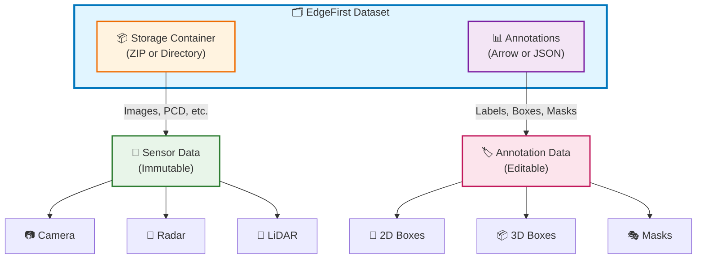
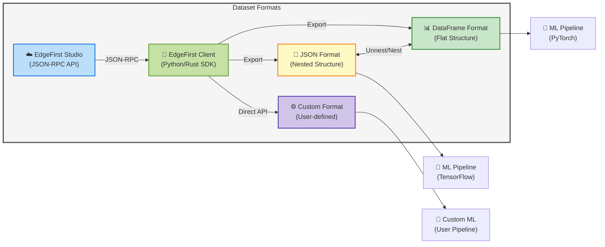
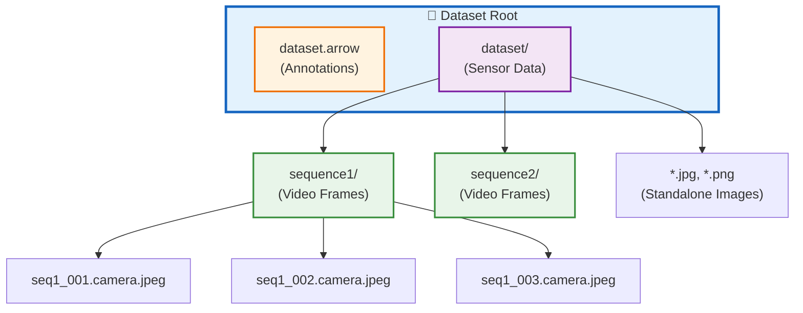
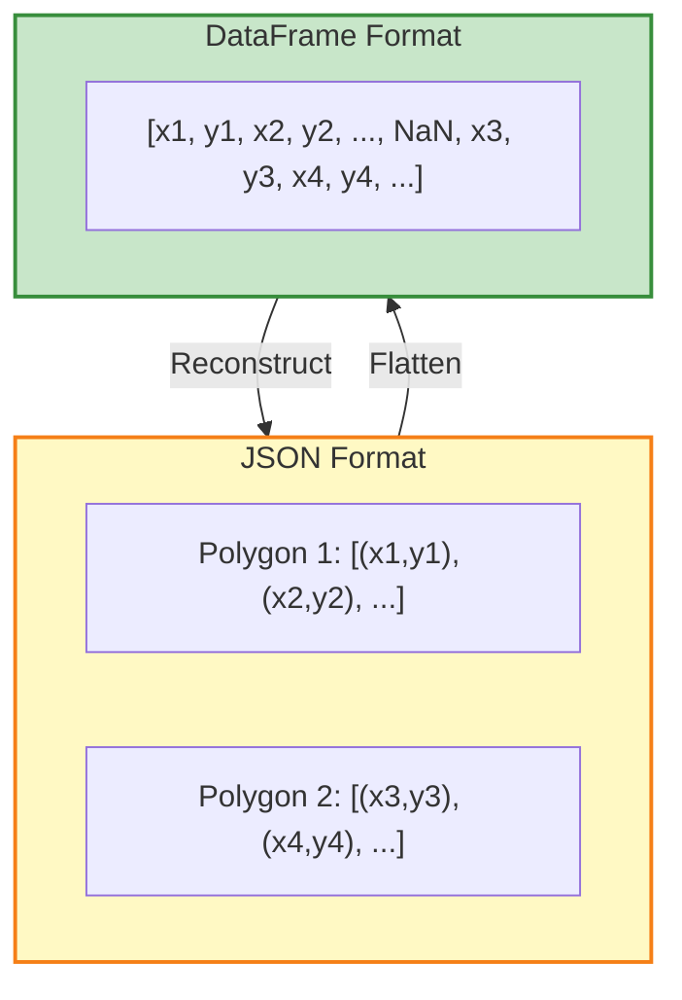
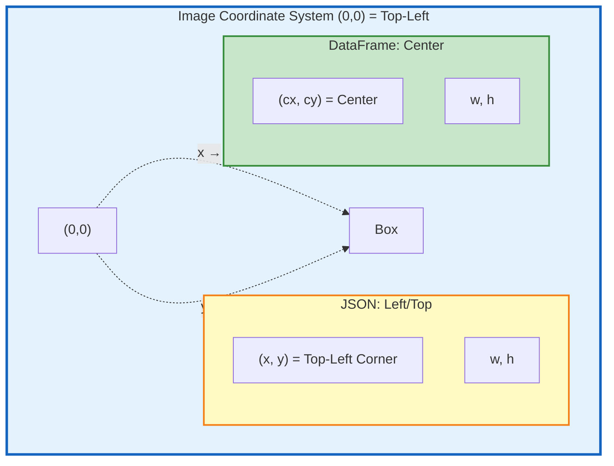
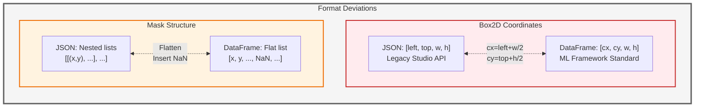

# EdgeFirst Dataset Format Specification

**Version**: 2025.10  
**Last Updated**: 31 October, 2025  
**Status**: ACTIVE

---

## Table of Contents

1. [Overview](#overview)
2. [Dataset Architecture](#dataset-architecture)
3. [Storage Formats](#storage-formats)
   - [Directory Structure](#directory-structure)
   - [File Organization](#file-organization)
4. [Sensor Data](#sensor-data)
   - [Camera](#camera)
   - [Radar](#radar)
   - [LiDAR](#lidar)
5. [Annotation Formats](#annotation-formats)
   - [DataFrame Format (Arrow/Polars)](#dataframe-format-arrowpolars)
   - [JSON Format (Nested)](#json-format-nested)
   - [Format Comparison](#format-comparison)
6. [Annotation Schema](#annotation-schema)
   - [Field Definitions](#field-definitions)
   - [Geometry Types](#geometry-types)
   - [Sample Metadata](#sample-metadata)
7. [Format Deviations](#format-deviations)
8. [Conversion Guidelines](#conversion-guidelines)
9. [Best Practices](#best-practices)
10. [Version History](#version-history)

---

## Overview

EdgeFirst datasets support multi-sensor data from camera, radar, and LiDAR sources, combined with rich annotations for object detection, segmentation, and tracking. The format distinguishes between:

- **Sensor Data** (static): Images, point clouds, and sensor readings stored as files
- **Annotation Data** (dynamic): Labels, bounding boxes, and masks stored in structured formats



**Key Principles**:
- **Normalized coordinates**: All spatial data uses 0..1 range (resolution-independent)
- **Two annotation formats**: DataFrame (flat, columnar) and JSON (nested, human-readable)
- **Both formats contain annotations and sample metadata**: DataFrame and JSON both store complete annotation and sample data
- **Lossless data representation**: All annotation data and sample metadata converts between formats without loss

---

## Dataset Architecture

### Format Relationship



Both formats represent the same annotation and sample metadata, but with different structural approaches:
- **JSON**: One object per sample, with nested annotations array
- **DataFrame**: One row per annotation, with sample fields repeated

**Note**: The EdgeFirst Client SDK (Python/Rust) provides direct API access to export data in any custom format without requiring JSON conversion. Use the API methods to access raw data and transform to your preferred structure.
- **JSON**: One object per sample, with nested annotations array
- **DataFrame**: One row per annotation, with sample fields repeated

---

## Storage Formats

### Directory Structure

EdgeFirst datasets support three organizational patterns:



#### 1. Sequence-Based Datasets

Video frames with temporal ordering (from MCAP recordings or video files):

```
<dataset_name>/
├── <dataset_name>.arrow          # Annotation metadata
└── <dataset_name>/               # Sensor container
    ├── <sequence_one>/
    │   ├── <sequence_one>_001.camera.jpeg
    │   ├── <sequence_one>_002.camera.jpeg
    │   └── ...
    ├── <sequence_two>/
    │   ├── <sequence_two>_001.camera.jpeg
    │   └── ...
    └── ...
```

**File naming convention**:
- Sequence format: `{hostname}_{date}_{time}` (from MCAP)
- Frame format: `{sequence_name}_{frame_number}.{sensor}.{ext}`

**Example**:
```
deer_dataset/
├── deer_dataset.arrow
└── deer_dataset/
    └── 9331381uhd_3840_2160_24fps/
        ├── 9331381uhd_3840_2160_24fps_110.camera.jpeg
        ├── 9331381uhd_3840_2160_24fps_111.camera.jpeg
        └── ...
```

#### 2. Image-Based Datasets

Standalone images without temporal ordering (from COCO, mobile devices, etc.):

```
<dataset_name>/
├── <dataset_name>.arrow          # Annotation metadata
└── <dataset_name>/               # Sensor container
    ├── image001.jpg
    ├── image002.jpg
    └── ...
```

#### 3. Mixed Datasets

Combination of sequences and standalone images:

```
<dataset_name>/
├── <dataset_name>.arrow          # Annotation metadata
└── <dataset_name>/               # Sensor container
    ├── <sequence_one>/           # Video sequence
    │   └── *.camera.jpeg
    ├── standalone_image1.jpg      # Standalone image
    ├── standalone_image2.jpg      # Standalone image
    └── ...
```

### File Organization

**Arrow file location**: Always at root level: `{dataset_name}/{dataset_name}.arrow`

**Sensor container**: Directory or ZIP file with same base name as Arrow file

**Flattening option**:
- Default (`flatten=False`): Sequences in subdirectories
- Flattened (`flatten=True`): All files directly in container (no subdirectories)

**ZIP format support**: EdgeFirst uses ZIP64 (standardized 2001) for broad compatibility:
- Random access via file index
- Optional per-file compression
- Cross-platform support

---

## Sensor Data

### Camera

**Format**: JPEG (default) or PNG  
**Source**: H.265 video from MCAP converted to discrete frames

**EXIF metadata** (embedded in images):
- GPS coordinates (from MCAP `/gps` topic or NavSat)
- Capture timestamp
- Camera parameters
- Device information

**File extensions**:
- `.camera.jpeg` - Camera image (default)
- `.camera.png` - Camera image (lossless)
- `.jpg`, `.png` - Generic image formats

### Radar

#### Point Cloud Data

**Format**: PCD (Point Cloud Data)  
**Extension**: `.radar.pcd`

**Fields**:
```
x, y, z          # Cartesian position (meters)
speed            # Velocity (m/s)
power            # Signal power
noise            # Noise level
rcs              # Radar cross-section
```

#### Radar Data Cube

**Format**: 16-bit PNG (lossless encoding of complex int16 data)  
**Extension**: `.radar.png`

**Dimensions**: `[sequence, rx_antenna, range_bins, doppler_bins]`  
**Typical shape**: `[2, 4, 200, 256]`

**PNG encoding**:
- 4×2 grid layout (4 columns = RX antennas, 2 rows = sequences)
- Complex int16 split into pair of int16 values (PNG doesn't support complex)
- **int16 shifted to uint16** for PNG storage (shift back to int16 for processing)
- Double-width matrices (complex pairs)
- **Output size**: 2048×400 pixels for standard cube

**Visualization note**: Wide dynamic range with most data near zero makes visualization challenging.

### LiDAR

**Format**: PCD (Point Cloud Data)  
**Extension**: `.lidar.pcd`

**Additional formats**:
- `.lidar.png` - Depth map visualization
- `.lidar.jpeg` - Reflectivity visualization

**Configuration**: Based on Maivin MCAP Recorder settings (specifics TBD)

---

## Annotation Formats

EdgeFirst supports two annotation formats optimized for different use cases.

### DataFrame Format (Arrow/Polars)

**Technology**: [Apache Arrow](https://arrow.apache.org/) with [Polars](https://pola.rs/) interface

**Structure**: Flat columnar format (one row per annotation)

**Schema**:
```python
(
    ('name', String),
    ('frame', UInt64),
  ('object_id', String),
    ('label', Categorical(ordering='physical')),
    ('label_index', UInt64),
    ('group', Categorical(ordering='physical')),
    ('mask', List(Float32)),
    ('box2d', Array(Float32, shape=(4,))),  # [cx, cy, w, h]
    ('box3d', Array(Float32, shape=(6,))),  # [x, y, z, w, h, l]
    ('size', Array(UInt32, shape=(2,))),  # [width, height] - OPTIONAL
    ('location', Array(Float32, shape=(2,))),  # [lat, lon] - OPTIONAL
    ('pose', Array(Float32, shape=(3,))),  # [yaw, pitch, roll] - OPTIONAL
    ('degradation', String)  # OPTIONAL
)
```

**Note**: Sample metadata fields (size, location, pose, degradation) are optional columns added in version 2025.10. Files from earlier versions will not have these columns.

**Array formats**:
- **box2d**: `[cx, cy, w, h]` - center coordinates and dimensions
- **box3d**: `[x, y, z, w, h, l]` - center coordinates and dimensions  
- **size**: `[width, height]` - image dimensions in pixels (new in 2025.10)
- **location**: `[lat, lon]` - GPS coordinates (latitude, longitude)
- **pose**: `[yaw, pitch, roll]` - IMU orientation in degrees (new in 2025.10)

**Characteristics**:
- Columnar compression (smaller file size)
- Efficient querying and filtering
- High-performance in-memory processing
- Multi-language support (Python, JavaScript, Rust)
- SQL-like operations via Polars

**Use cases**:
- Data analysis and exploration
- Efficient batch processing
- Training pipelines (PyTorch DataLoader)
- Statistical queries

**Loading**:
```python
import polars as pl
df = pl.read_ipc("dataset.arrow")
```

### JSON Format (Nested)

**Structure**: Nested format (one object per sample, annotations array)

**Example**:
```json
{
  "image_name": "deer_001.camera.jpeg",
  "width": 1920,
  "height": 1080,
  "frame_number": 1,
  "sequence_name": "deer_sequence",
  "group_name": "train",
  "sensors": {
    "gps": {
      "latitude": 37.7749,
      "longitude": -122.4194,
      "altitude": 10.5
    },
    "imu": {
      "roll": 0.5,
      "pitch": -1.2,
      "yaw": 45.3
    }
  },
  "annotations": [
    {
      "label_name": "deer",
      "label_index": 0,
  "object_id": "550e8400-e29b-41d4-a716-446655440000",
      "box2d": {
        "x": 0.683854,
        "y": 0.342593,
        "w": 0.015104,
        "h": 0.050926
      },
      "mask": {
        "polygon": [
          [[0.69, 0.34], [0.69, 0.34], [0.70, 0.35]],
          [[0.71, 0.36], [0.72, 0.37]]
        ]
      }
    }
  ]
}
```

**Characteristics**:
- Human-readable and editable
- Preserves sample metadata (width, height, sensors, GPS, IMU)
- Includes unannotated samples (empty annotations array)
- Compatible with Studio API
- Self-documenting structure

**Use cases**:
- Manual editing and auditing
- API communication (Studio RPC)
- Dataset distribution and archival
- Documentation and examples

### Format Comparison

| Aspect | DataFrame (Arrow) | JSON (Nested) |
|--------|------------------|---------------|
| **Structure** | Flat (one row per annotation) | Nested (sample → annotations[]) |
| **File Size** | Smaller (columnar compression) | Larger (text-based) |
| **Performance** | Fast batch operations | Moderate (parse overhead) |
| **Readability** | Requires viewer/library | Human-readable text |
| **Sample Metadata** | Optional columns: size, location, pose arrays (2025.10+) | Nested in sample object |
| **Unannotated Samples** | Included (one row with null annotations to preserve metadata) | Included (empty array) |
| **Editing** | Programmatic (Polars API) | Manual or programmatic |
| **Box2D Format** | `[cx, cy, w, h]` array (center) | `{x, y, w, h}` object (left/top) |
| **Box3D Format** | `[x, y, z, w, h, l]` array (center) | `{x, y, z, w, h, l}` object (center) |
| **Mask Format** | Flat list with NaN separators | Nested list of polygons |
| **Best For** | Analysis, training, querying | Editing, API, distribution |

---

## Annotation Schema

### Field Definitions

#### name
**Type**: `String`  
**Description**: Sample identifier extracted from image filename

**Extraction rules**:
1. Remove file extension (everything after last `.`)
2. Remove `.camera` suffix if present
3. Remove `_frame` suffix (for sequences)

**Examples**:
- `scene_001.camera.jpg` → `scene_001`
- `deer_sequence_042.jpg` → `deer_sequence` (frame stripped)
- `background.png` → `background`

#### frame
**Type**: `UInt64` (nullable)  
**Description**: Frame number within a sequence

- **Sequences**: Extracted from `frame_number` field
- **Standalone images**: `null`

**File naming**:
- Sequence: `{name}_{frame}.{ext}` → `deer_sequence_042.jpg`
- Standalone: `{name}.{ext}` → `background.jpg`

#### object_id
**Type**: `String` (nullable)  
**Description**: Unique identifier for tracking objects across frames and linking different annotation types.

**Use cases**:
- Tracking the same object across subsequent frames in a sequence
- Associating multiple annotation geometries (e.g., Box2D + Mask) with one object
- Multi-sensor data fusion where objects must be synchronized

**Uniqueness**: Must be unique across the **entire dataset** for a given object.

**Format**: UUID strongly recommended (guaranteed uniqueness). Legacy exports may use custom identifiers; they remain supported but should be migrated to UUIDs when possible.

**Examples**:
- `550e8400-e29b-41d4-a716-446655440000` (UUID - recommended)
- `deer_01`, `car_track_5` (ensure uniqueness manually)

> **Compatibility note**: Prior documentation referred to this field as `object_reference`. The client now uses `object_id` while still accepting `object_reference` when parsing older data.

#### label_name
**Type**: `Categorical` (String)  
**Description**: Object class or category

**Examples**: `person`, `deer`, `car`, `tree`

**Note**: Named `label_name` (not `label`) to distinguish from `label_index`

#### label_index
**Type**: `UInt64`  
**Description**: Numeric index for custom label ordering

**Use case**: Pre-trained models (e.g., COCO) require specific indices

**Example**: COCO indices are non-alphabetical:
```
0: person
1: bicycle
2: car
...
```

For labels `[person, car, tree]`, "car" might have `label_index=2` (COCO) instead of `1` (alphabetical)

#### group
**Type**: `Categorical` (String)  
**Description**: Dataset split assignment (train/val/test)

**CRITICAL**: This is a **SAMPLE-LEVEL field**, not annotation-level

**DataFrame behavior**: Value repeated for each annotation row (table is flat)

**JSON field name**: `group_name` (at sample level, EdgeFirst Studio API)
- **Note**: The EdgeFirst Studio API uses `group_name` for both upload and download
- Arrow/DataFrame format uses column name `group` for compatibility with ML pipelines
- When converting between JSON and DataFrame, map `group_name` ↔ `group`

**Typical values**: `train`, `val`, `test`

---

### Geometry Types

#### Mask

**Purpose**: Pixel-level segmentation boundaries

**Coordinate system**: Normalized (0..1)



**JSON Format**:
```json
{
  "mask": {
    "polygon": [
      [[0.69, 0.34], [0.69, 0.34], [0.70, 0.35]],
      [[0.71, 0.36], [0.72, 0.37], [0.73, 0.38]]
    ]
  }
}
```
- Structure: List of polygons (nested lists)
- Each polygon: List of `(x, y)` tuples  
- Multiple polygons: Separate lists in outer array
- **Studio API**: May receive as RLE (Run-Length Encoding), decoded to polygon vertices by client library

**DataFrame Format**:
```python
mask: [0.69, 0.34, 0.69, 0.34, 0.70, 0.35, NaN, 0.71, 0.36, 0.72, 0.37, 0.73, 0.38]
```
- Type: `List(Float32)`
- Structure: Flattened coordinates with NaN separators
- Reason: Polars doesn't support nested list-of-lists
- Multiple polygons: Separated by `NaN` values

**Conversion**:
- JSON → DataFrame: Flatten nested structure, insert NaN between polygons
- DataFrame → JSON: Split on NaN, reconstruct nested lists

#### Box2D

**Purpose**: 2D bounding boxes in camera images

**Coordinate system**: Normalized (0..1), top-left origin



**⚠️ FORMAT DIFFERS BETWEEN JSON AND DATAFRAME**

**JSON Format** (Studio API legacy):
```json
{
  "box2d": {
    "x": 0.683854,    // left edge
    "y": 0.342593,    // top edge
    "w": 0.015104,    // width
    "h": 0.050926     // height
  }
}
```
- Origin: Top-left corner
- Fields: `x` (left), `y` (top), `w`, `h`
- Reason: Legacy Studio RPC API format

**DataFrame Format** (Preferred):
```python
box2d: [0.691406, 0.368056, 0.015104, 0.050926]
```
- Type: `Array(Float32, shape=(4,))`
- Format: `[cx, cy, width, height]`
- Origin: Box center
- Conversion: `cx = left + width/2`, `cy = top + height/2`
- Reason: Standard in ML frameworks (YOLO, etc.)

**Example (1920×1080 image)**:
```
JSON:      {x: 0.683854, y: 0.342593, w: 0.015104, h: 0.050926}
DataFrame: [0.691406, 0.368056, 0.015104, 0.050926]

Pixel coordinates:
  Left:   0.683854 × 1920 = 1313px
  Top:    0.342593 × 1080 = 370px
  Width:  0.015104 × 1920 = 29px
  Height: 0.050926 × 1080 = 55px
  
  Center: (1313 + 29/2, 370 + 55/2) = (1327.5px, 397.5px)
  cx:     1327.5 / 1920 = 0.691406 ✓
  cy:     397.5 / 1080 = 0.368056 ✓
```

#### Box3D

**Purpose**: 3D bounding boxes in world coordinates

**Coordinate system**: ROS/Ouster (X=forward, Y=left, Z=up), normalized (0..1)

**✅ SAME FORMAT IN JSON AND DATAFRAME**

**Both formats use center-point representation**:

**JSON Format**:
```json
{
  "box3d": {
    "x": 0.45,    // center X
    "y": 0.12,    // center Y
    "z": 0.03,    // center Z
    "w": 0.08,    // width
    "h": 0.06,    // height
    "l": 0.15     // length
  }
}
```

**DataFrame Format**:
```python
box3d: [0.45, 0.12, 0.03, 0.08, 0.06, 0.15]
```
- Type: `Array(Float32, shape=(6,))`
- Format: `[x, y, z, width, height, length]`
- All coordinates are center-points

**Reference**: 
- [ROS Coordinate Conventions](https://www.ros.org/reps/rep-0103.html#coordinate-frame-conventions)
- [Ouster Sensor Frame](https://static.ouster.dev/sensor-docs/image_route1/image_route2/sensor_data/sensor-data.html#sensor-coordinate-frame)

---

### Sample Metadata

Sample-level metadata (image dimensions, GPS, IMU, degradation) is available in **both JSON and DataFrame formats**.

**DataFrame representation**: Array columns, repeated for each annotation row (flat structure)  
**JSON representation**: Nested objects in sample (one copy per sample)

#### size (width, height)
**Type**: `Array(UInt32, shape=(2,))` (DataFrame), `Integer` fields (JSON)  
**Description**: Image dimensions in pixels

**DataFrame**: Array column `size` = `[width, height]`, repeated per row  
**JSON**: Separate top-level `width` and `height` fields

**Example**:
```python
# DataFrame (all rows from same sample have same size)
shape: (3, 13)
┌────────────┬───────┬─────────────┬───────┐
│ name       │ frame │ size        │ ...   │
├────────────┼───────┼─────────────┼───────┤
│ sample_001 │ 0     │ [1920,1080] │ ...   │
│ sample_001 │ 0     │ [1920,1080] │ ...   │
│ sample_001 │ 0     │ [1920,1080] │ ...   │
└────────────┴───────┴─────────────┴───────┘

# Access: df['size'][0] = width, df['size'][1] = height

# JSON (separate width/height fields)
{
  "name": "sample_001",
  "width": 1920,
  "height": 1080,
  "annotations": [...]
}
```

#### sensors
**Type**: `Array` (DataFrame), `Object` (JSON)  
**Description**: Multi-sensor metadata (GPS, IMU)

##### GPS Location

**Data sources**:
- Image EXIF GPS tags
- MCAP `/gps` topic (NavSat)
- User-provided coordinates

**DataFrame**: `location` column as `Array(Float32, shape=(2,))` = `[lat, lon]` (new in 2025.10)  
**JSON**: Nested object with `latitude`, `longitude` fields

**JSON structure**:
```json
{
  "sensors": {
    "gps": {
      "latitude": 37.7749,
      "longitude": -122.4194
    }
  }
}
```

**DataFrame structure**:
```python
# location column: Array [lat, lon]
[37.7749, -122.4194]

# Access: df['location'][0] = lat, [1] = lon
```

**Note**: Altitude support may be added in a future version when Studio adds support for it.

**Rust type**: `Option<Location>` with `gps: Option<GpsData>`

##### IMU Orientation

**Data sources**:
- MCAP `/imu` topic (Maivin/Raivin)
- IMU sensor readings
- User-provided orientation

**DataFrame**: `pose` column as `Array(Float32, shape=(3,))` = `[yaw, pitch, roll]` in degrees  
**JSON**: Nested object with `roll`, `pitch`, `yaw` fields

**Format**: All values in degrees

**JSON structure**:
```json
{
  "sensors": {
    "imu": {
      "roll": 0.5,
      "pitch": -1.2,
      "yaw": 45.3
    }
  }
}
```

**DataFrame structure**:
```python
# pose column: Array [yaw, pitch, roll]
[45.3, -1.2, 0.5]

# Access: df['pose'][0] = yaw, [1] = pitch, [2] = roll
```

**Rust type**: `Option<Location>` with `imu: Option<ImuData>`

#### degradation
**Type**: `String` (nullable)  
**Description**: User-defined visual quality indicator for camera images

**Purpose**: Indicates camera compromise (fog, rain, obstruction, low light) in multi-sensor datasets

**Typical values**:
- `none` - Clear view, objects fully visible
- `low` - Slight obstruction, targets clearly visible
- `medium` - Higher obstruction, targets visible but not obvious
- `high` - Severe obstruction, objects cannot be seen

**Use cases**:
- Filter samples by image quality for training
- Train robust models for adverse weather conditions
- Multi-sensor fusion (use radar/LiDAR when camera degraded)
- Dataset quality analysis and reporting

**JSON example**:
```json
{
  "image_name": "foggy_scene.jpg",
  "degradation": "medium"
}
```

**Note**: This field is implemented in EdgeFirst Client. Studio support will be added in a future release.

---

## Format Deviations

**CRITICAL**: JSON and DataFrame formats differ in two key areas:



### 1. Box2D Representation

| Format | JSON | DataFrame |
|--------|------|-----------|
| **Origin** | Top-left corner | Box center |
| **Coordinates** | `{x, y, w, h}` | `[cx, cy, w, h]` |
| **x/cx** | Left edge (0..1) | Center X (0..1) |
| **y/cy** | Top edge (0..1) | Center Y (0..1) |
| **Conversion** | - | `cx = x + w/2, cy = y + h/2` |
| **Reason** | Legacy Studio API | ML framework standard (YOLO) |

### 2. Mask Storage

| Format | JSON | DataFrame |
|--------|------|-----------|
| **Structure** | Nested lists | Flat list |
| **Format** | `[[(x,y), ...], ...]` | `[x, y, ..., NaN, ...]` |
| **Polygons** | Separate lists | NaN-separated |
| **Type** | JSON array | `List(Float32)` |
| **Reason** | Natural nesting | Polars limitation |

---

## Conversion Guidelines

### JSON → DataFrame

```python
import polars as pl

# Read JSON samples
samples = load_json("annotations.json")

# Convert to DataFrame (unnest annotations)
annotations = []
for sample in samples:
    # Extract sample metadata once
    size = [sample.get("width"), sample.get("height")]  # Array [width, height]
    
    # GPS: JSON nested object → DataFrame array [lat, lon]
    location = None
    if sample.get("sensors", {}).get("gps"):
        gps_data = sample["sensors"]["gps"]
        location = [
            gps_data["latitude"],
            gps_data["longitude"]
        ]
    
    # IMU: JSON nested object → DataFrame array [yaw, pitch, roll]
    pose = None
    if sample.get("sensors", {}).get("imu"):
        imu_data = sample["sensors"]["imu"]
        pose = [
            imu_data["yaw"],
            imu_data["pitch"],
            imu_data["roll"]
        ]
    
    degradation = sample.get("degradation")  # Degradation field (new in 2025.10)
    
    for ann in sample["annotations"]:
    row = {
            "name": extract_name(sample["image_name"]),
            "frame": sample.get("frame_number"),
      "object_id": ann.get("object_id") or ann.get("object_reference"),
            "label": ann["label_name"],  # Column name: 'label'
            "label_index": ann.get("label_index"),
            "group": sample.get("group"),  # JSON field 'group' → column 'group'
            "mask": flatten_mask(ann.get("mask")),  # Flatten with NaN
            "box2d": [  # Array [cx, cy, w, h]
                ann["box2d"]["x"] + ann["box2d"]["w"] / 2,  # cx
                ann["box2d"]["y"] + ann["box2d"]["h"] / 2,  # cy
                ann["box2d"]["w"],
                ann["box2d"]["h"]
            ],
            "box3d": [  # Array [x, y, z, w, h, l]
                ann["box3d"]["x"],
                ann["box3d"]["y"],
                ann["box3d"]["z"],
                ann["box3d"]["w"],
                ann["box3d"]["h"],
                ann["box3d"]["l"]
            ] if ann.get("box3d") else None,
            "size": size,          # Sample metadata (new in 2025.10)
            "location": location,  # GPS array [lat, lon]
            "pose": pose,          # IMU array [yaw, pitch, roll]
            "degradation": degradation,
        }
        annotations.append(row)

df = pl.DataFrame(annotations)
df.write_ipc("annotations.arrow")
```

**Key conversions**:
1. **Unnest**: One row per annotation (from nested structure)
2. **Column names**: JSON `label_name` → DataFrame `label`, JSON `group` → DataFrame `group`
3. **Sample metadata**: Optional columns added in 2025.10 (size, location, pose, degradation)
4. **GPS conversion**: `{"latitude": lat, "longitude": lon}` → array `[lat, lon]`
5. **IMU conversion**: `{"roll": r, "pitch": p, "yaw": y}` → array `[yaw, pitch, roll]`
6. **Box2D**: `{x, y, w, h}` → array `[cx: x+w/2, cy: y+h/2, w, h]`
7. **Box3D**: `{x, y, z, w, h, l}` → array `[x, y, z, w, h, l]`
8. **Mask**: Nested lists → Flat list with NaN separators
9. **Size**: Separate width/height → array `[width, height]`

### DataFrame → JSON

```python
import polars as pl

df = pl.read_ipc("annotations.arrow")

# Group by sample (name + frame)
samples = []
for (name, frame), group_df in df.groupby(["name", "frame"]):
    # Get sample metadata (same for all rows in group)
    first_row = group_df.row(0, named=True)
    
    # Extract optional metadata columns (new in 2025.10)
    size_array = first_row.get("size")  # Array [width, height]
    
    # GPS: DataFrame array [lat, lon] → JSON nested object
    gps_data = None
    if first_row.get("location"):
        loc = first_row["location"]  # Array [lat, lon]
        gps_data = {
            "latitude": loc[0],   # lat
            "longitude": loc[1]   # lon
        }
    
    # IMU: DataFrame array [yaw, pitch, roll] → JSON nested object
    imu_data = None
    if first_row.get("pose"):
        pose_array = first_row["pose"]  # Array [yaw, pitch, roll]
        imu_data = {
            "yaw": pose_array[0],
            "pitch": pose_array[1],
            "roll": pose_array[2]
        }
    
    # Build annotations
    annotations = []
    for row in group_df.iter_rows(named=True):
        box2d_array = row["box2d"]  # Array [cx, cy, w, h]
        ann = {
            "label_name": row["label"],  # DataFrame column 'label' → JSON 'label_name'
            "label_index": row["label_index"],
      "object_id": row.get("object_id") or row.get("object_reference"),
            "box2d": {  # Array [cx, cy, w, h] → JSON {x, y, w, h}
                "x": box2d_array[0] - box2d_array[2] / 2,  # cx - w/2
                "y": box2d_array[1] - box2d_array[3] / 2,  # cy - h/2
                "w": box2d_array[2],
                "h": box2d_array[3]
            },
            "mask": {"polygon": unflatten_mask(row["mask"])},  # NaN → nested lists
        }
        
        # Box3D: Array [x, y, z, w, h, l] → JSON {x, y, z, w, h, l}
        if row.get("box3d"):
            box3d_array = row["box3d"]
            ann["box3d"] = {
                "x": box3d_array[0],
                "y": box3d_array[1],
                "z": box3d_array[2],
                "w": box3d_array[3],
                "h": box3d_array[4],
                "l": box3d_array[5]
            }
        
  annotations.append(ann)
    
    sample = {
        "image_name": f"{name}_{frame}.camera.jpeg" if frame else f"{name}.jpg",
        "frame_number": frame,
        "group": first_row["group"],  # DataFrame column 'group' → JSON 'group'
        "annotations": annotations,
    }
    
    # Add optional size metadata (new in 2025.10)
    if size_array:
        sample["width"] = size_array[0]
        sample["height"] = size_array[1]
    
    # Add degradation if present (new in 2025.10)
    if first_row.get("degradation"):
        sample["degradation"] = first_row["degradation"]
    
    # Add sensors if present
    if gps_data or imu_data:
        sample["sensors"] = {}
        if gps_data:
            sample["sensors"]["gps"] = gps_data
        if imu_data:
            sample["sensors"]["imu"] = imu_data
    
    samples.append(sample)

save_json(samples, "annotations.json")
```

**Key conversions**:
1. **Nest**: Group annotations by sample (name, frame)
2. **Column names**: DataFrame `label` → JSON `label_name`, DataFrame `group` → JSON `group`
3. **Optional metadata**: Check for size, location, pose, degradation columns (added in 2025.10)
4. **GPS conversion**: array `[lat, lon]` → `{"latitude": lat, "longitude": lon}`
5. **IMU conversion**: array `[yaw, pitch, roll]` → `{"yaw": y, "pitch": p, "roll": r}`
6. **Box2D**: array `[cx, cy, w, h]` → `{x: cx-w/2, y: cy-h/2, w, h}`
7. **Box3D**: array `[x, y, z, w, h, l]` → `{x, y, z, w, h, l}`
8. **Mask**: Flat list → Split on NaN, nest into polygon lists
9. **Size**: array `[width, height]` → separate width/height fields

---

## Best Practices

### Format Selection

**Use DataFrame (Arrow) when**:
- Analyzing annotation statistics
- Training ML models (PyTorch, TensorFlow)
- Filtering/querying annotations efficiently
- Processing large datasets (>10k samples)
- Working with Polars/Pandas pipelines

**Use JSON when**:
- Manually editing annotations
- Communicating with EdgeFirst Studio API
- Distributing datasets (human-readable)
- Documenting dataset structure
- Need sample metadata (GPS, IMU, dimensions)

### Dataset Organization

**Sequences**:
- Use subdirectories for each sequence
- Maintain temporal ordering (frame numbers)
- Include all sensor types per frame

**Standalone images**:
- Place directly in dataset folder
- Use descriptive filenames
- Consider grouping by category if needed

### Annotation Quality

**Object reference**:
- Use UUIDs for guaranteed uniqueness
- Track objects consistently across frames
- Link related annotations (box + mask)

**Label index**:
- Use pre-trained model indices (COCO, ImageNet)
- Document custom index mapping
- Keep indices stable across dataset versions

**Group assignment**:
- Typical split: 70% train, 20% val, 10% test
- Balance classes across splits
- Assign groups before annotation to prevent leakage

### File Naming

**Sequences**:
```
{hostname}_{date}_{time}/
  └── {hostname}_{date}_{time}_{frame}.{sensor}.{ext}
```

**Standalone**:
```
{descriptive_name}.{ext}
```

**Sensor extensions**:
- `.camera.jpeg`, `.camera.png` - Camera images
- `.radar.pcd` - Radar point cloud
- `.radar.png` - Radar data cube
- `.lidar.pcd` - LiDAR point cloud
- `.depth.png` - Depth map

---

## Version History

### Version 2025.10 - Current

**Comprehensive Specification Update**

This version provides a complete formalization of the EdgeFirst Dataset Format, documenting both JSON and DataFrame (Arrow) formats with detailed schemas, conversion guidelines, and best practices. No breaking changes were made to existing formats.

#### Specification Enhancements

**JSON Format Formalization**:
- Complete schema definition for all annotation types (Box2D, Box3D, mask)
- Documented sample metadata structure (width, height, sensors)
- Formalized GPS and IMU sensor data representation
- Clarified field naming conventions and data types
- Added degradation field for visual quality tracking

**DataFrame Format Documentation**:
- Detailed Arrow/Parquet schema with exact data types
- Documented array formats for geometry (box2d, box3d)
- Added optional sample metadata columns for richer analysis
- Clarified column naming (label, group) for consistency

**Conversion Guidelines**:
- Step-by-step JSON ↔ DataFrame conversion examples
- Format-specific considerations (Box2D center vs corner, mask flattening)
- Handling of optional fields and missing data

#### New Optional DataFrame Columns

**Sample Metadata** (backward compatible additions):
- `size`: `Array(UInt32, shape=(2,))` = `[width, height]` - Image dimensions
- `location`: `Array(Float32, shape=(2,))` = `[lat, lon]` - GPS coordinates
- `pose`: `Array(Float32, shape=(3,))` = `[yaw, pitch, roll]` - IMU orientation in degrees
- `degradation`: `String` - Visual quality indicator (fog, rain, obstruction, low light)

**Note**: These columns are optional. DataFrames from version 2025.01 without these columns remain fully valid.

#### Column Names (Unchanged)

**DataFrame column names** (backward compatible):
- `label` (Categorical): Label name - standard since 2025.01
- `group` (Categorical): Dataset split (train/val/test) - standard since 2025.01
- `object_id` (String): UUID for object tracking - standard since 2025.01 (legacy alias `object_reference` accepted on read)
- `label_index` (UInt64): Numerical label index - standard since 2025.01

#### Benefits

1. **Formalized specification**: Complete documentation of JSON and DataFrame formats
2. **Richer metadata**: Access sample properties (size, GPS, IMU) directly in DataFrame
3. **Visual quality tracking**: Filter/analyze by degradation level for adverse conditions
4. **Better DX**: Clear conversion guidelines and format comparison
5. **Backward compatible**: Optional additions don't break existing code or files

#### Backward Compatibility

**No migration required**: DataFrames from 2025.01 remain fully compatible. New columns are optional.

```python
# 2025.01 DataFrame (9 columns) - still valid
df_old = load_arrow("annotations_2025_01.arrow")
# Works as before: name, frame, object_id, label, label_index, 
#                  group, mask, box2d, box3d

# 2025.10 DataFrame (13 columns) - with optional metadata
df_new = load_arrow("annotations_2025_10.arrow")
# Additional columns available (if present):
if 'size' in df_new.columns:
    width = df_new['size'][0]
    height = df_new['size'][1]

if 'location' in df_new.columns:
    lat = df_new['location'][0]
    lon = df_new['location'][1]

if 'pose' in df_new.columns:
    yaw = df_new['pose'][0]
    pitch = df_new['pose'][1]
    roll = df_new['pose'][2]

if 'degradation' in df_new.columns:
    quality = df_new['degradation']
```

#### Notes

- **Specification scope**: Comprehensive documentation of JSON and DataFrame formats, conversion patterns, and usage guidelines
- **Format stability**: Array-based types retained for simplicity and backward compatibility
- **Future enhancements**: Polars Struct types may be introduced in future version for named field access
- **Implementation status**: Degradation field supported in EdgeFirst Client; Studio support planned
- **GPS altitude**: May be added in future version when Studio adds support

### Version 2025.01

**Initial Format** (EdgeFirst Studio published format)

Baseline format with core annotation fields. Sample metadata (width, height, GPS, IMU) available only in JSON format, not in DataFrame.

**DataFrame Schema** (9 columns):
```python
(
    ('name', String),
    ('frame', UInt64),
    ('object_id', String),
    ('label', Categorical),
    ('label_index', UInt64),
    ('group', Categorical),
    ('mask', List(Float32)),
    ('box2d', Array(Float32, shape=(4,))),  # [cx, cy, w, h]
    ('box3d', Array(Float32, shape=(6,))),  # [x, y, z, w, h, l]
)
```

**Characteristics**:
- Minimal schema with core annotation fields only
- Sample metadata (width, height, GPS, IMU) available only in JSON format
- Compatible with 2025.10 (new columns are optional additions)

---

## Further Reading

- **[EdgeFirst Client](http://github.com/EdgeFirstAI/client)**: Python and Rust SDK documentation
- **[EdgeFirst Studio](http://doc.edgefirst.ai/test/)**: Web platform for annotation and dataset management
- [MCAP Format](https://mcap.dev)**: Multi-sensor recording format
- **Polars Documentation**: https://pola.rs/
