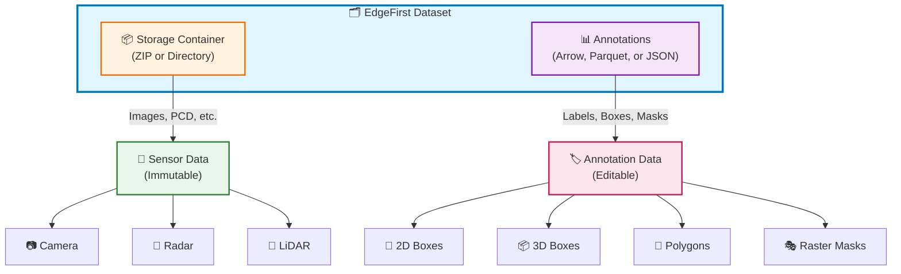
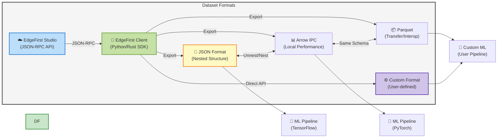
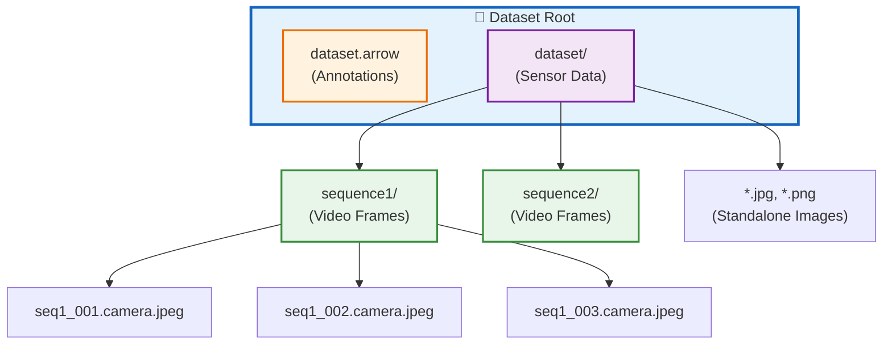
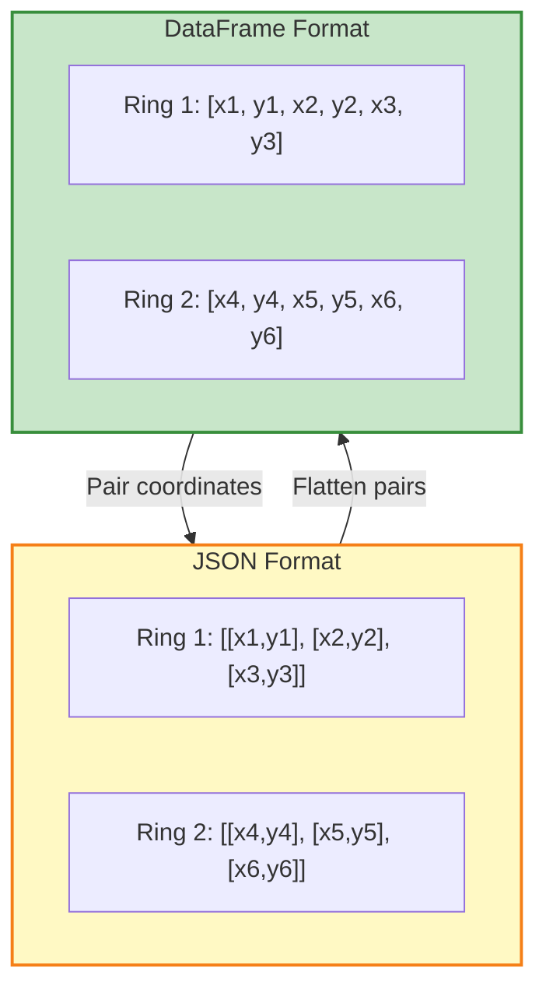
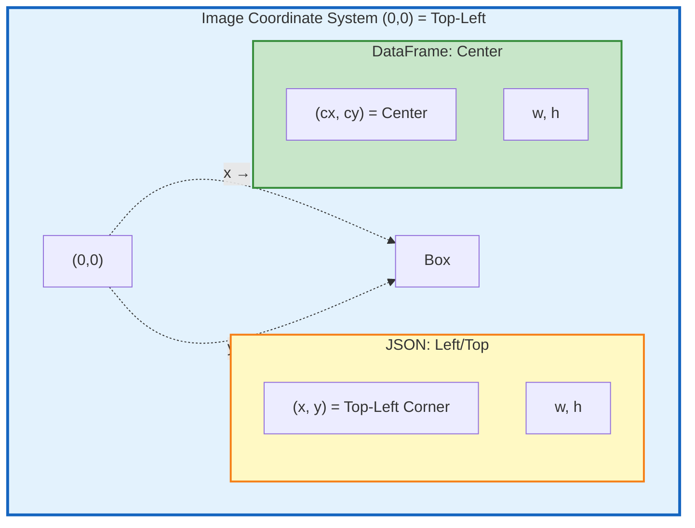

# EdgeFirst Dataset Format Specification

**Version**: 2026.04
**Last Updated**: 25 March, 2026
**Status**: DRAFT (pending review)

---

## Table of Contents

1. [Overview](#overview)
2. [Dataset Architecture](#dataset-architecture)
3. [Storage Formats](#storage-formats)
   - [Directory Structure](#directory-structure)
   - [File Organization](#file-organization)
4. [Sensor Data](#sensor-data)
   - [Camera](#camera)
   - [Radar](#radar)
   - [LiDAR](#lidar)
5. [Annotation Formats](#annotation-formats)
   - [DataFrame Format (Arrow/Parquet/Polars)](#dataframe-format-arrowparquetpolars)
   - [JSON Format (Nested)](#json-format-nested)
   - [Format Comparison](#format-comparison)
6. [File-Level Metadata](#file-level-metadata)
   - [Category Metadata](#category-metadata)
7. [Annotation Schema](#annotation-schema)
   - [Field Definitions](#field-definitions)
   - [Geometry Types](#geometry-types)
   - [Score Columns](#score-columns)
   - [Sample Metadata](#sample-metadata)
   - [Instrumentation](#instrumentation)
8. [Format Deviations](#format-deviations)
9. [Conversion Guidelines](#conversion-guidelines)
10. [Migration from 2025.10](#migration-from-202510)
11. [Best Practices](#best-practices)
12. [Version History](#version-history)

---

## Overview

EdgeFirst datasets support multi-sensor data from camera, radar, and LiDAR sources, combined with rich annotations for object detection, segmentation, and tracking. The format distinguishes between:

- **Sensor Data** (static): Images, point clouds, and sensor readings stored as files
- **Annotation Data** (dynamic): Labels, bounding boxes, and masks stored in structured formats


```mermaid
graph TB
    subgraph Dataset["🗂️ EdgeFirst Dataset"]
        direction TB
        Storage["📦 Storage Container<br/>(ZIP or Directory)"]
        Annotations["📊 Annotations<br/>(Arrow, Parquet, or JSON)"]
    end
    
    Storage --> |"Images, PCD, etc."| Sensor["🎥 Sensor Data<br/>(Immutable)"]
    Annotations --> |"Labels, Boxes, Masks"| Labels["🏷️ Annotation Data<br/>(Editable)"]
    
    Sensor --> Camera["📷 Camera"]
    Sensor --> Radar["📡 Radar"]
    Sensor --> LiDAR["🔦 LiDAR"]
    
    Labels --> Box2D["📐 2D Boxes"]
    Labels --> Box3D["📦 3D Boxes"]
    Labels --> Polygons["🔷 Polygons"]
    Labels --> Masks["🎭 Raster Masks"]
    
    style Dataset fill:#e1f5ff,stroke:#0277bd,stroke-width:3px
    style Storage fill:#fff3e0,stroke:#ef6c00,stroke-width:2px
    style Annotations fill:#f3e5f5,stroke:#7b1fa2,stroke-width:2px
    style Sensor fill:#e8f5e9,stroke:#2e7d32,stroke-width:2px
    style Labels fill:#fce4ec,stroke:#c2185b,stroke-width:2px
```

**Key Principles**:

- **Normalized coordinates**: All spatial data uses 0..1 range (resolution-independent)
- **Three storage formats**: Arrow IPC (local performance), Parquet (transfer/interop), JSON (human-readable)
- **Self-describing files**: File-level metadata describes schema version, box layouts, and mask interpretation
- **Both formats contain annotations and sample metadata**: DataFrame and JSON both store complete annotation and sample data
- **Lossless data representation**: All annotation data and sample metadata converts between formats without loss

---

## Dataset Architecture

### Format Relationship


```mermaid
graph LR
    subgraph Formats["Dataset Formats"]
        direction TB
        Studio["☁️ EdgeFirst Studio<br/>(JSON-RPC API)"]
        Client["🔧 EdgeFirst Client<br/>(Python/Rust SDK)"]
        JSON["📄 JSON Format<br/>(Nested Structure)"]
        Arrow["📊 Arrow IPC<br/>(Local Performance)"]
        Parquet["📦 Parquet<br/>(Transfer/Interop)"]
        Custom["⚙️ Custom Format<br/>(User-defined)"]
    end

    Studio -->|"JSON-RPC"| Client
    Client -->|"Export"| JSON
    Client -->|"Export"| Arrow
    Client -->|"Export"| Parquet
    Client -->|"Direct API"| Custom

    JSON <-->|"Unnest/Nest"| Arrow
    Arrow <-->|"Same Schema"| Parquet

    JSON --> ML1["🤖 ML Pipeline<br/>(TensorFlow)"]
    Arrow --> ML2["🤖 ML Pipeline<br/>(PyTorch)"]
    Parquet --> ML3["🤖 ML Pipeline<br/>(DuckDB/Spark)"]
    Custom --> ML3["🤖 Custom ML<br/>(User Pipeline)"]
    
    style Studio fill:#bbdefb,stroke:#1976d2,stroke-width:2px
    style Client fill:#c5e1a5,stroke:#689f38,stroke-width:2px
    style JSON fill:#fff9c4,stroke:#f57f17,stroke-width:2px
    style DF fill:#c8e6c9,stroke:#388e3c,stroke-width:2px
    style Custom fill:#d1c4e9,stroke:#5e35b1,stroke-width:2px
    style Formats fill:#f5f5f5,stroke:#616161,stroke-width:3px
```

Both formats represent the same annotation and sample metadata, but with different structural approaches:

- **JSON**: One object per sample, with nested annotations array
- **DataFrame**: One row per annotation, with sample fields repeated

**Note**: The EdgeFirst Client SDK (Python/Rust) provides direct API access to export data in any custom format without requiring JSON conversion. Use the API methods to access raw data and transform to your preferred structure.

- **JSON**: One object per sample, with nested annotations array
- **DataFrame**: One row per annotation, with sample fields repeated

---

## Storage Formats

### Directory Structure

EdgeFirst datasets support three organizational patterns:


```mermaid
graph TB
    subgraph Dataset["📁 Dataset Root"]
        direction TB
        Arrow["dataset.arrow<br/>(Annotations)"]
        Folder["dataset/<br/>(Sensor Data)"]
    end
    
    Folder --> Seq1["sequence1/<br/>(Video Frames)"]
    Folder --> Seq2["sequence2/<br/>(Video Frames)"]
    Folder --> Images["*.jpg, *.png<br/>(Standalone Images)"]
    
    Seq1 --> Frame1["seq1_001.camera.jpeg"]
    Seq1 --> Frame2["seq1_002.camera.jpeg"]
    Seq1 --> Frame3["seq1_003.camera.jpeg"]
    
    style Dataset fill:#e3f2fd,stroke:#1565c0,stroke-width:3px
    style Arrow fill:#fff3e0,stroke:#ef6c00,stroke-width:2px
    style Folder fill:#f3e5f5,stroke:#7b1fa2,stroke-width:2px
    style Seq1 fill:#e8f5e9,stroke:#388e3c,stroke-width:2px
    style Seq2 fill:#e8f5e9,stroke:#388e3c,stroke-width:2px
```

#### 1. Sequence-Based Datasets

Video frames with temporal ordering (from MCAP recordings or video files):

```
<dataset_name>/
├── <dataset_name>.arrow          # Annotation metadata
└── <dataset_name>/               # Sensor container
    ├── <sequence_one>/
    │   ├── <sequence_one>_001.camera.jpeg
    │   ├── <sequence_one>_002.camera.jpeg
    │   └── ...
    ├── <sequence_two>/
    │   ├── <sequence_two>_001.camera.jpeg
    │   └── ...
    └── ...
```

**File naming convention**:

- Sequence format: `{hostname}_{date}_{time}` (from MCAP)
- Frame format: `{sequence_name}_{frame_number}.{sensor}.{ext}`

**Example**:

```
deer_dataset/
├── deer_dataset.arrow
└── deer_dataset/
    └── 9331381uhd_3840_2160_24fps/
        ├── 9331381uhd_3840_2160_24fps_110.camera.jpeg
        ├── 9331381uhd_3840_2160_24fps_111.camera.jpeg
        └── ...
```

#### 2. Image-Based Datasets

Standalone images without temporal ordering (from COCO, mobile devices, etc.):

```
<dataset_name>/
├── <dataset_name>.arrow          # Annotation metadata
└── <dataset_name>/               # Sensor container
    ├── image001.jpg
    ├── image002.jpg
    └── ...
```

#### 3. Mixed Datasets

Combination of sequences and standalone images:

```
<dataset_name>/
├── <dataset_name>.arrow          # Annotation metadata
└── <dataset_name>/               # Sensor container
    ├── <sequence_one>/           # Video sequence
    │   └── *.camera.jpeg
    ├── standalone_image1.jpg      # Standalone image
    ├── standalone_image2.jpg      # Standalone image
    └── ...
```

### File Organization

**Arrow file location**: Always at root level: `{dataset_name}/{dataset_name}.arrow`

**Sensor container**: Directory or ZIP file with same base name as Arrow file

#### Directory Structure Options

EdgeFirst supports two organizational patterns for sensor data:

**1. Nested Structure (Default)**

Sequences are organized in subdirectories:

```
dataset_name/
├── dataset_name.arrow
└── dataset_name/
    ├── sequence_A/
    │   ├── sequence_A_001.camera.jpeg
    │   └── sequence_A_002.camera.jpeg
    ├── sequence_B/
    │   ├── sequence_B_001.camera.jpeg
    │   └── sequence_B_002.camera.jpeg
    └── standalone_image.jpg
```

**2. Flattened Structure**

All files in a single directory with sequence prefixes:

```
dataset_name/
├── dataset_name.arrow
└── dataset_name/
    ├── sequence_A_001.camera.jpeg
    ├── sequence_A_002.camera.jpeg
    ├── sequence_B_001.camera.jpeg
    ├── sequence_B_002.camera.jpeg
    └── standalone_image.jpg
```

#### File Naming Conventions

**Sequence samples** (when `frame` column is not-null in Arrow file):

- **Nested**: `{sequence_name}/{sequence_name}_{frame}.{sensor}.{ext}`
- **Flattened**: `{sequence_name}_{frame}_{original_name}` (where `original_name` includes the extension)

**Standalone samples** (when `frame` column is null):

- **Nested**: `{image_name}.{ext}`
- **Flattened**: `{image_name}.{ext}` (unchanged)

#### Client Implementation Guidelines

**For Upload Operations:**

Clients should support both nested and flattened structures:

1. **Build image index** - Walk the entire directory tree recursively
2. **Match by filename** - Use flexible matching that works for both structures:
   - Try exact filename match first
   - Try filename without extension
   - Try stripping `.camera` suffix for compatibility
3. **Preserve sequence metadata** - Use Arrow file `name` and `frame` columns as authoritative source
4. **Detect structure automatically** - No manual configuration needed

**For Download Operations:**

- Use `flatten=false` (default) to preserve sequence subdirectories
- Use `flatten=true` to download all files to a single directory
- When `flatten=true`, filenames are automatically prefixed with `{sequence_name}_{frame}_` if not already present

**ZIP format support**: EdgeFirst uses ZIP64 (standardized 2001) for broad compatibility:

- Random access via file index
- Optional per-file compression
- Cross-platform support

---

## Sensor Data

### Camera

**Format**: JPEG (default) or PNG  
**Source**: H.265 video from MCAP converted to discrete frames

**EXIF metadata** (embedded in images):

- GPS coordinates (from MCAP `/gps` topic or NavSat)
- Capture timestamp
- Camera parameters
- Device information

**File extensions**:

- `.camera.jpeg` - Camera image (default)
- `.camera.png` - Camera image (lossless)
- `.jpg`, `.png` - Generic image formats

### Radar

#### Point Cloud Data

**Format**: PCD (Point Cloud Data)  
**Extension**: `.radar.pcd`

**Fields**:

```
x, y, z          # Cartesian position (meters)
speed            # Velocity (m/s)
power            # Signal power
noise            # Noise level
rcs              # Radar cross-section
```

#### Radar Data Cube

**Format**: 16-bit PNG (lossless encoding of complex int16 data)  
**Extension**: `.radar.png`

**Dimensions**: `[sequence, rx_antenna, range_bins, doppler_bins]`  
**Typical shape**: `[2, 4, 200, 256]`

**PNG encoding**:

- 4×2 grid layout (4 columns = RX antennas, 2 rows = sequences)
- Complex int16 split into pair of int16 values (PNG doesn't support complex)
- **int16 shifted to uint16** for PNG storage (shift back to int16 for processing)
- Double-width matrices (complex pairs)
- **Output size**: 2048×400 pixels for standard cube

**Visualization note**: Wide dynamic range with most data near zero makes visualization challenging.

### LiDAR

**Format**: PCD (Point Cloud Data)
**Extension**: `.lidar.pcd`

**Configuration**: Based on Maivin MCAP Recorder settings (specifics TBD)

> **Removed in 2026.04**: The `.lidar.png` (depth map) and `.lidar.jpeg` (reflectivity) projected visualization formats have been removed from the format specification. The SDK retains read support for backward compatibility but will not write these types. Consumers should project PCD data to depth/reflectivity images if needed.

---

## Annotation Formats

EdgeFirst supports three annotation storage formats optimized for different use cases.

### DataFrame Format (Arrow/Parquet/Polars)

**Technology**: [Apache Arrow](https://arrow.apache.org/) IPC or [Apache Parquet](https://parquet.apache.org/) with [Polars](https://pola.rs/) interface

**Structure**: Flat columnar format (one row per annotation instance)

**Storage Tiers**:

| Format | Extension | Use Case | Characteristics |
|--------|-----------|----------|-----------------|
| Arrow IPC | `.arrow` | Local ML training, fast random access | Zero-copy memory mapping, fastest local performance |
| Parquet | `.parquet` | Transfer, cloud storage, interop | ZSTD columnar compression, compatible with DuckDB/Spark/pandas |

Both formats share the same logical schema. Arrow IPC is optimized for local performance; Parquet is optimized for transfer and interoperability. Use Arrow for training pipelines, Parquet for distribution.

> **Note**: This schema is defined for the 2026.04 release. The current SDK (2.x) implements the 2025.10 schema. See the [Version History](#version-history) section for the 2025.10 schema.

**Schema (2026.04)**:

```python
(
    # ── Identity & Classification ──────────────────────
    ('name', String),
    ('frame', UInt32),  # Corrected from UInt64 in 2025.10 spec — implementation always used UInt32
    ('object_id', String),
    ('label', Categorical(ordering='physical')),
    ('label_index', UInt64),
    ('group', Categorical(ordering='physical')),

    # ── Geometry: Polygon ──────────────────────────────
    ('polygon', List(List(Float32))),  # interleaved [x1,y1,x2,y2,...] per ring
    ('polygon_score', Float32),  # OPTIONAL - confidence (0..1)

    # ── Geometry: Raster Mask ──────────────────────────
    ('mask', Binary),  # PNG-encoded grayscale raster pixels
    ('mask_score', Float32),  # OPTIONAL - per-instance confidence (0..1)

    # ── Geometry: 2D Bounding Box ──────────────────────
    ('box2d', Array(Float32, shape=(4,))),  # layout from metadata, default [cx, cy, w, h]
    ('box2d_score', Float32),  # OPTIONAL - confidence (0..1)

    # ── Geometry: 3D Bounding Box ──────────────────────
    ('box3d', Array(Float32, shape=(6,))),  # [cx, cy, cz, w, h, l]
    ('box3d_score', Float32),  # OPTIONAL - confidence (0..1)

    # ── Annotation Metadata (optional) ────────────────
    ('iscrowd', Boolean),  # OPTIONAL - true = crowd region, false or absent = single instance (COCO)
    ('category_frequency', Categorical(ordering='physical')),  # OPTIONAL - "f", "c", "r" (LVIS)

    # ── Sample Metadata (optional) ─────────────────────
    ('size', Array(UInt32, shape=(2,))),  # [width, height] - image dimensions
    ('location', Array(Float32, shape=(2,))),  # [lat, lon]
    ('pose', Array(Float32, shape=(3,))),  # [yaw, pitch, roll]
    ('degradation', String),
    ('neg_label_indices', List(UInt32)),  # OPTIONAL - label_index values verified absent (LVIS)
    ('not_exhaustive_label_indices', List(UInt32)),  # OPTIONAL - label_index values with incomplete annotation (LVIS)

    # ── Instrumentation (optional) ─────────────────────
    ('timing', Struct({  # Int64 nanosecond durations
        'load': Int64,
        'preprocess': Int64,
        'inference': Int64,
        'decode': Int64,
    })),
)
```

**Changes from 2025.10**: The `mask` column changed from `List(Float32)` (NaN-separated polygon coordinates) to `Binary` (PNG-encoded raster pixels). Polygon data moved to the new `polygon` column as `List(List(Float32))`. The `iscrowd` column changed from `UInt8` to `Boolean`. Score columns, timing struct, Parquet support, COCO/LVIS extension columns (`iscrowd`, `category_frequency`, `neg_label_indices`, `not_exhaustive_label_indices`), and `category_metadata` file-level metadata are new in 2026.04. The `label_index` column now preserves source category IDs (non-contiguous). See [Migration from 2025.10](#migration-from-202510) for details.

**Array formats**:

- **polygon**: `List(List(Float32))` - outer list = rings, inner list = interleaved `[x1, y1, x2, y2, ...]` pairs per ring
- **mask**: `Binary` - PNG-encoded grayscale raster pixels (self-describing dimensions from PNG header)
- **box2d**: `[cx, cy, w, h]` - center coordinates and dimensions (default; see [File-Level Metadata](#file-level-metadata) for other layouts)
- **box3d**: `[cx, cy, cz, w, h, l]` - center coordinates and dimensions
- **size**: `[width, height]` - image dimensions in pixels
- **location**: `[lat, lon]` - GPS coordinates (latitude, longitude)
- **pose**: `[yaw, pitch, roll]` - IMU orientation in degrees
- **timing**: `Struct{load, preprocess, inference, decode}` - Int64 nanosecond durations

**Characteristics**:

- Columnar compression (smaller file size)
- Efficient querying and filtering
- High-performance in-memory processing
- Multi-language support (Python, JavaScript, Rust)
- SQL-like operations via Polars

**Use cases**:

- Data analysis and exploration
- Efficient batch processing
- Training pipelines (PyTorch DataLoader)
- Statistical queries

**Loading**:

```python
import polars as pl
df = pl.read_ipc("dataset.arrow")
```

### JSON Format (Nested)

**Structure**: Nested format (one object per sample, annotations array)

**Example**:

```json
{
  "image_name": "deer_001.camera.jpeg",
  "width": 1920,
  "height": 1080,
  "frame_number": 1,
  "sequence_name": "deer_sequence",
  "group_name": "train",
  "sensors": {
    "gps": {
      "latitude": 37.7749,
      "longitude": -122.4194,
      "altitude": 10.5
    },
    "imu": {
      "roll": 0.5,
      "pitch": -1.2,
      "yaw": 45.3
    }
  },
  "annotations": [
    {
      "label_name": "deer",
      "label_index": 0,
      "object_id": "550e8400-e29b-41d4-a716-446655440000",
      "box2d": {
        "x": 0.683854,
        "y": 0.342593,
        "w": 0.015104,
        "h": 0.050926
      },
      "mask": {
        "polygon": [
          [[0.69, 0.34], [0.69, 0.34], [0.70, 0.35]],
          [[0.71, 0.36], [0.72, 0.37]]
        ]
      }
    }
  ]
}
```

**Characteristics**:

- Human-readable and editable
- Preserves sample metadata (width, height, sensors, GPS, IMU)
- Includes unannotated samples (empty annotations array)
- Compatible with Studio API
- Self-documenting structure

**Use cases**:

- Manual editing and auditing
- API communication (Studio RPC)
- Dataset distribution and archival
- Documentation and examples

### Format Comparison

| Aspect | DataFrame (Arrow) | JSON (Nested) |
|--------|------------------|---------------|
| **Structure** | Flat (one row per annotation) | Nested (sample → annotations[]) |
| **File Size** | Smaller (columnar compression) | Larger (text-based) |
| **Performance** | Fast batch operations | Moderate (parse overhead) |
| **Readability** | Requires viewer/library | Human-readable text |
| **Sample Metadata** | Optional columns: size, location, pose arrays (2025.10+) | Nested in sample object |
| **Unannotated Samples** | Included (one row with null annotations to preserve metadata) | Included (empty array) |
| **Editing** | Programmatic (Polars API) | Manual or programmatic |
| **Box2D Format** | Array, layout from metadata (default: `[cx, cy, w, h]`) | Object, layout from metadata (default: `{x, y, w, h}`) |
| **Box3D Format** | `[cx, cy, cz, w, h, l]` array (center) | `{x, y, z, w, h, l}` object (center) |
| **Polygon Format** | `List(List(Float32))` interleaved xy per ring | Nested list of `[x,y]` point pairs |
| **Mask Format** | `Binary` PNG-encoded raster | base64-encoded PNG bytes |
| **Best For** | Analysis, training, querying | Editing, API, distribution |

---

## File-Level Metadata

Both Arrow IPC and Parquet support key-value metadata at the schema/file level. This enables self-describing files where readers can determine the schema version, box layout, and mask interpretation without external context.

All metadata values are strings.

| Key | Values | Default (absent) | Description |
|-----|--------|-------------------|-------------|
| `schema_version` | `"2026.04"` | `"2025.10"` | Format version. Absent = legacy file. |
| `box2d_format` | `"cxcywh"`, `"xyxy"`, `"ltwh"` | `"cxcywh"` | Box2D array layout descriptor |
| `box2d_normalized` | `"true"`, `"false"` | `"true"` | Box2D coordinate system |
| `box3d_format` | `"cxcyczwhl"` | `"cxcyczwhl"` | Box3D array layout descriptor |
| `box3d_normalized` | `"true"`, `"false"` | `"true"` | Box3D coordinate system |
| `mask_interpretation` | `"binary"`, `"confidence"`, `"sigmoid"`, `"logits"` | `"binary"` | Pixel value meaning for raster masks |
| `category_metadata` | JSON string | absent | Per-label metadata (synset, synonyms, definition) |
| `labels` | JSON array `["person", "car", ...]` | absent | Ordered class names for semantic segmentation masks. `labels[i]` = class name for argmax pixel value `i`. |

### Category Metadata

The `category_metadata` key stores per-label reference data as a JSON-encoded string. This is optional metadata that enriches label semantics without adding per-row columns for data that is constant across all annotations sharing the same label.

**Structure**: JSON object keyed by `label_name`, with optional fields per label:

```json
{
  "aerosol_can": {
    "id": 1,
    "supercategory": "accessory",
    "synset": "aerosol.n.02",
    "synonyms": ["aerosol_can", "spray_can"],
    "definition": "a dispenser that holds a substance under pressure"
  },
  "person": {
    "id": 1,
    "supercategory": "human",
    "synset": "person.n.01",
    "synonyms": ["person", "individual"],
    "definition": "a human being"
  }
}
```

| Field | Type | Description |
|-------|------|-------------|
| `id` | integer | Source category ID (used to reconstruct `category_id` for categories with no annotations) |
| `supercategory` | string | Parent category name (e.g., `"vehicle"`, `"animal"`) |
| `synset` | string | WordNet synset identifier (e.g., `"aerosol.n.02"`) |
| `synonyms` | array of strings | Alternate names for the category |
| `definition` | string | Natural language definition (LVIS `def` field, renamed for clarity) |

**Source**: When importing from COCO with LVIS extensions, these fields are populated from the LVIS `categories` array. Other datasets with taxonomic metadata can populate the same fields.

**Note**: The `frequency` field from LVIS is stored as the `category_frequency` column (not in this metadata) because it is directly useful for DataFrame filtering and disaggregated metrics (AP_r/AP_c/AP_f). The `image_count` and `instance_count` fields from LVIS are intentionally not stored — they are recomputable statistics.

### Labels Metadata (NEW in 2026.04)

The `labels` key stores an ordered array of class names as a JSON-encoded string. This metadata provides the index-to-name mapping for semantic segmentation masks where each pixel value is an argmax class index.

**Structure**: JSON array where `labels[i]` is the class name for pixel value `i`:

```json
["background", "person", "car", "bicycle", "dog"]
```

In this example, pixel value `0` = `"background"`, pixel value `1` = `"person"`, pixel value `2` = `"car"`, etc.

**When written**: Optional — only written when the source dataset provides an ordered category list (e.g., COCO categories sorted by ID).

**Relationship to `category_metadata`**: The `labels` array provides index ordering for mask pixel interpretation. The `category_metadata` object provides rich per-label reference data (synset, synonyms, definition). Both may be present; they complement each other.

### Box Format Descriptors

**`box2d_format` values**:

| Value | Array Layout | Description |
|-------|-------------|-------------|
| `cxcywh` | `[center_x, center_y, width, height]` | ML standard (YOLO, etc.) |
| `xyxy` | `[x_min, y_min, x_max, y_max]` | Corner-pair format |
| `ltwh` | `[left, top, width, height]` | COCO/Studio legacy format |

**`box3d_format` values**:

| Value | Array Layout | Description |
|-------|-------------|-------------|
| `cxcyczwhl` | `[center_x, center_y, center_z, width, height, length]` | Center of bounding box |

Box3D coordinates represent the geometric center of the 3D bounding box. Width (w) = X-axis extent, Height (h) = Y-axis extent, Length (l) = Z-axis extent.

### Default Box Format by Storage Type

When metadata is **absent** (backward compatibility with older files):

| Storage Format | Default box2d_format | Reason |
|---------------|---------------------|--------|
| Arrow IPC | `cxcywh` | Backward compat with 2025.10 Arrow files |
| Parquet | `cxcywh` | New format, follows Arrow convention |
| JSON (file) | `ltwh` | Backward compat with Studio JSON-RPC API |
| JSON-RPC API | Always `ltwh` | Fixed protocol, cannot be changed |

When metadata **IS** present, it is authoritative regardless of storage format. This resolves the previously-implicit format deviation between Arrow and JSON.

### Mask Interpretation

The `mask_interpretation` metadata describes how to interpret pixel values in the `mask` column (PNG-encoded raster data). The PNG bit depth determines the value range:

| Value | Description |
|-------|-------------|
| `binary` | 0/1 values — use 1-bit PNG (default) |
| `confidence` | Quantized confidence scores — use 8-bit (0–255) or 16-bit (0–65535) PNG |
| `sigmoid` | Quantized sigmoid outputs — use 8-bit or 16-bit PNG |
| `logits` | Quantized logit outputs — use 8-bit or 16-bit PNG |

### Schema Version Strategy

Version format is `YYYY.MM` with mandatory zero-padding (e.g., `"2025.10"`, `"2026.04"`). Versions are compared lexicographically. The zero-padding ensures lexicographic order matches calendar order.

Readers should handle any version they recognize. Unknown future versions should trigger a warning (not an error) and attempt best-effort reading via Arrow/Parquet schema introspection.

---

## Annotation Schema

### Field Definitions

#### name

**Type**: `String`  
**Description**: Sample identifier extracted from image filename

**Extraction rules**:

1. Remove file extension (everything after last `.`)
2. Remove `.camera` suffix if present
3. Remove `_frame` suffix (for sequences)

**Examples**:

- `scene_001.camera.jpg` → `scene_001`
- `deer_sequence_042.jpg` → `deer_sequence` (frame stripped)
- `background.png` → `background`

#### frame

**Type**: `UInt32` (nullable)
**Description**: Frame number within a sequence

- **Sequences**: Extracted from `frame_number` field
- **Standalone images**: `null`

**File naming**:

- Sequence: `{name}_{frame}.{ext}` → `deer_sequence_042.jpg`
- Standalone: `{name}.{ext}` → `background.jpg`

#### object_id

**Type**: `String` (nullable)  
**Description**: Unique identifier for tracking objects across frames and linking different annotation types.

**Use cases**:

- Tracking the same object across subsequent frames in a sequence
- Associating multiple annotation geometries (e.g., Box2D + Mask) with one object
- Multi-sensor data fusion where objects must be synchronized

**Uniqueness**: Must be unique across the **entire dataset** for a given object.

**Format**: UUID strongly recommended (guaranteed uniqueness). Legacy exports may use custom identifiers; they remain supported but should be migrated to UUIDs when possible.

**Examples**:

- `550e8400-e29b-41d4-a716-446655440000` (UUID - recommended)
- `deer_01`, `car_track_5` (ensure uniqueness manually)

> **Compatibility note**: Prior documentation referred to this field as `object_reference`. The client now uses `object_id` while still accepting `object_reference` when parsing older data.

#### label / label_name

**Type**: `Categorical` (String)
**Description**: Object class or category

**Examples**: `person`, `deer`, `car`, `tree`

**Column name**: `label` in Arrow/Parquet DataFrames. The JSON-RPC API uses `label_name` for the same field. When converting between formats, map `label_name` ↔ `label`.

#### label_index

**Type**: `UInt64`
**Description**: Source category index, preserved from the originating dataset or annotation tool

**Semantics**: `label_index` is the **source-faithful** category identifier. When importing from COCO, LVIS, or EdgeFirst Studio, the original `category_id` is stored directly as `label_index`. This value:

- **May be non-contiguous** — COCO uses IDs 1–90 for 80 categories (gaps at 12, 26, 29, 30, etc.). LVIS uses IDs up to ~1723 for 1,203 categories.
- **May not start at zero** — COCO starts at 1, not 0.
- **Must be preserved on round-trip** — exporting back to COCO/LVIS must reconstruct the original `category_id` from `label_index`.

**Studio compatibility**: EdgeFirst Studio must accept and return non-contiguous `label_index` values. Clients must not assume contiguous or zero-based indices.

**Model training note**: Models are typically trained with a dense remapping (e.g., 80 contiguous class indices for COCO). This remapping is a model-specific concern handled in the training pipeline, not in the dataset format. Some legacy models (notably older SSDs) are trained with the original gaps and produce 91 outputs (90 categories + background); this is likewise a model-specific convention.

**Example**: COCO 80-category indices (showing gaps):

```
 1: person
 2: bicycle
 3: car
...
11: fire hydrant
    (no 12)
13: stop sign
14: parking meter
...
25: umbrella
    (no 26)
27: handbag
28: tie
    (no 29, 30)
31: skis
...
```

For a dataset with labels `[person, car, tree]` imported from COCO, `label_index` values would be `1` (person), `3` (car), and whatever index the source assigns to `tree` — NOT alphabetically re-indexed.

#### group

**Type**: `Categorical` (String)  
**Description**: Dataset split assignment (train/val/test)

**CRITICAL**: This is a **SAMPLE-LEVEL field**, not annotation-level

**DataFrame behavior**: Value repeated for each annotation row (table is flat)

**JSON field name**: `group_name` (at sample level, EdgeFirst Studio API)

- **Note**: The EdgeFirst Studio API uses `group_name` for both upload and download
- Arrow/DataFrame format uses column name `group` for compatibility with ML pipelines
- When converting between JSON and DataFrame, map `group_name` ↔ `group`

**Typical values**: `train`, `val`, `test`

#### iscrowd (NEW in 2026.04)

**Type**: `Boolean` (nullable)
**Description**: Whether this annotation represents a crowd region or a single instance

**Values**:

- `true` — Crowd region containing multiple overlapping instances of the same category
- `false` or absent — Single object instance

**Source**: COCO `iscrowd` field. LVIS does not use crowd annotations — this column will be absent or null for LVIS-sourced data.

**Use cases**:

- Evaluation protocols treat crowd regions differently (matched but not penalized as false negatives)
- Training pipelines may exclude crowd annotations
- Round-trip fidelity with COCO format

#### category_frequency (NEW in 2026.04)

**Type**: `Categorical` (String, nullable)
**Description**: Long-tail frequency group for the annotation's category

**Values**:

- `"f"` — **Frequent**: category appears in >100 training images
- `"c"` — **Common**: category appears in 11–100 training images
- `"r"` — **Rare**: category appears in 1–10 training images

**Source**: LVIS `categories[].frequency` field. Absent for datasets without frequency metadata.

**Use cases**:

- Disaggregated evaluation metrics (AP_r, AP_c, AP_f)
- Long-tail distribution analysis
- Oversampling rare categories during training
- Filtering: `df.filter(pl.col("category_frequency") == "r")` to analyze rare-class performance

---

### Geometry Types

#### Polygon (NEW in 2026.04)

**Purpose**: Instance-level segmentation boundaries as vector contours

**Coordinate system**: Always normalized (0..1)


```mermaid
graph TB
    subgraph JSON["JSON Format"]
        direction LR
        J1["Ring 1: [[x1,y1], [x2,y2], [x3,y3]]"]
        J2["Ring 2: [[x4,y4], [x5,y5], [x6,y6]]"]
    end

    subgraph DF["DataFrame Format"]
        direction LR
        D1["Ring 1: [x1, y1, x2, y2, x3, y3]"]
        D2["Ring 2: [x4, y4, x5, y5, x6, y6]"]
    end

    JSON -->|"Flatten pairs"| DF
    DF -->|"Pair coordinates"| JSON

    style JSON fill:#fff9c4,stroke:#f57f17,stroke-width:2px
    style DF fill:#c8e6c9,stroke:#388e3c,stroke-width:2px
```

**JSON Format**:

```json
{
  "polygon": [
    [[0.69, 0.34], [0.70, 0.35], [0.71, 0.36]],
    [[0.72, 0.37], [0.73, 0.38], [0.74, 0.35]]
  ],
  "polygon_score": 0.92
}
```

- Structure: List of polygon rings, each ring is a list of `[x, y]` point pairs
- Multiple rings: Separate lists in outer array (disjoint parts, holes)
- **Studio API**: May receive as RLE (Run-Length Encoding), decoded to polygon vertices by client library

**DataFrame Format**:

```python
polygon: [[0.69, 0.34, 0.70, 0.35, 0.71, 0.36], [0.72, 0.37, 0.73, 0.38, 0.74, 0.35]]
```

- Type: `List(List(Float32))`
- Outer list: Multiple polygon rings per instance
- Inner list: Interleaved `[x1, y1, x2, y2, ...]` coordinate pairs for one ring
- **Validity**: Inner lists must have even length (coordinate pairs). Minimum 6 values (3 points) per valid ring.

**Conversion**:

- JSON → DataFrame: Flatten each ring's `[[x,y], ...]` to `[x, y, x, y, ...]`
- DataFrame → JSON: Pair consecutive floats into `[x, y]` tuples

**Coordinate space**: Polygon coordinates are **always** image-space normalized (0..1), regardless of whether `box2d` coexists on the same row. The box provides object location; the polygon provides the boundary in absolute image coordinates.

**Coexistence with mask**: `polygon` and `mask` can coexist on different rows in the same dataset (e.g., some annotations have polygon contours, others have raster masks). They can also coexist on the same row (polygon gives the boundary, mask gives dense pixel data).

> **Migration from 2025.10**: The old `mask: List(Float32)` column (NaN-separated polygon coordinates) is replaced by `polygon: List(List(Float32))`. See [Migration from 2025.10](#migration-from-202510).

#### Mask (CHANGED in 2026.04)

**Purpose**: Dense per-pixel raster masks (semantic segmentation, instance masks from inference)

**Type**: `Binary` — PNG-encoded grayscale raster pixels

```json
{
  "mask": "<base64-encoded PNG bytes>",
  "mask_score": 0.89
}
```

**Encoding**: Masks are stored as single-channel (grayscale) PNG images within the `Binary` column. The PNG format provides:

- **Self-describing dimensions** — width and height in the PNG header (first 24 bytes), readable without full decode
- **Lossless compression** — PNG's filtering + DEFLATE handles sparse masks efficiently
- **Bit depth flexibility** — PNG supports 1, 2, 4, 8, and 16-bit grayscale

| Source | PNG bit depth | Pixel values | Use case |
|--------|--------------|--------------|----------|
| Binary mask (any source) | **1-bit (preferred)** | 0/1 | Ground truth, thresholded output, COCO RLE import. Always use 1-bit for binary masks — unambiguous and most compact. |
| Sigmoid scores | 8-bit | 0–255 (quantized) | Model confidence per-pixel |
| High-precision scores | 16-bit | 0–65535 | When 8-bit quantization is insufficient |

**1-bit is the preferred encoding for all binary masks**, regardless of source (COCO RLE, thresholded model output, ground truth annotations). Alternatives like 8-bit with 0/255 are valid but wasteful and ambiguous — a reader cannot distinguish "binary mask stored as 8-bit" from "8-bit score data." 1-bit encoding is self-documenting: if the PNG is 1-bit, the mask is binary.

PNG does not support floating-point pixel values. If float precision is needed in the future, a different encoding would be introduced as a new column type.

**Dimensions**: Mask dimensions are defined by the PNG image itself, not by the `size` column or `box2d`. The producer determines the resolution:

- **Model output resolution** (e.g., 256x256 from the model head)
- **Model input resolution** (e.g., 640x640 after preprocessing)
- **Image resolution** (original sensor dimensions)

Consumers rescale to the target coordinate space as needed. The `size` column (image dimensions) can be used as the target when rescaling to image space.

**Interpretation by context**:

| Context | Pixel values | Label source |
|---------|-------------|-------------|
| `mask` + `box2d` (instance seg) | Sigmoid confidence (0–255) or binary (0/1) for a single instance | `label` column on the row |
| `mask` without `box2d` (semantic seg) | Argmax class indices | Optional file-level `labels` metadata; index ordering is model-specific |

- **Instance segmentation**: The mask covers the **full image** (not cropped to the box). Most pixels are 0 (background); the object region has confidence scores or binary 1 values. This avoids lossy cropping and handles interpolation that extends beyond box bounds.
- **Semantic segmentation**: Each pixel value is a class index. The mapping from index to class name is provided by the optional `labels` file-level metadata.

The mask is **always image-sized** (or model-output-sized). Never box-cropped.

- **JSON representation**: base64-encoded PNG bytes
- **Relationship to polygon**: `polygon` and `mask` can coexist (e.g., panoptic segmentation with instance polygons and semantic raster masks). Typically a dataset uses one or the other.

#### Box2D

**Purpose**: 2D bounding boxes in camera images

**Coordinate system**: Normalized (0..1), top-left origin


```mermaid
graph TB
    subgraph Image["Image Coordinate System (0,0) = Top-Left"]
        direction LR
        Origin["(0,0)"]
        Box["Box"]
        
        subgraph JSON_Box["JSON: Left/Top"]
            JPoint["(x, y) = Top-Left Corner"]
            JDim["w, h"]
        end
        
        subgraph DF_Box["DataFrame: Center"]
            DPoint["(cx, cy) = Center"]
            DDim["w, h"]
        end
    end
    
    Origin -.->|"x →"| Box
    Origin -.->|"y ↓"| Box
    
    style JSON_Box fill:#fff9c4,stroke:#f57f17,stroke-width:2px
    style DF_Box fill:#c8e6c9,stroke:#388e3c,stroke-width:2px
    style Image fill:#e3f2fd,stroke:#1565c0,stroke-width:3px
```

**⚠️ Box2D layout is configurable via `box2d_format` metadata (new in 2026.04)**

The array layout and JSON field names depend on the `box2d_format` metadata key. See [File-Level Metadata](#file-level-metadata) for all supported formats and defaults.

**Default JSON Format** (`ltwh` — Studio API legacy, default for JSON when metadata absent):

```json
{
  "box2d": {
    "x": 0.683854,    // left edge
    "y": 0.342593,    // top edge
    "w": 0.015104,    // width
    "h": 0.050926     // height
  },
  "box2d_score": 0.97
}
```

**Default DataFrame Format** (`cxcywh` — default for Arrow/Parquet when metadata absent):

```python
box2d: [0.691406, 0.368056, 0.015104, 0.050926]
```

- Type: `Array(Float32, shape=(4,))`
- Format: `[cx, cy, width, height]`
- Origin: Box center
- Conversion: `cx = left + width/2`, `cy = top + height/2`
- Reason: Standard in ML frameworks (YOLO, etc.)

**Example (1920×1080 image)**:

```
JSON:      {x: 0.683854, y: 0.342593, w: 0.015104, h: 0.050926}
DataFrame: [0.691406, 0.368056, 0.015104, 0.050926]

Pixel coordinates:
  Left:   0.683854 × 1920 = 1313px
  Top:    0.342593 × 1080 = 370px
  Width:  0.015104 × 1920 = 29px
  Height: 0.050926 × 1080 = 55px
  
  Center: (1313 + 29/2, 370 + 55/2) = (1327.5px, 397.5px)
  cx:     1327.5 / 1920 = 0.691406 ✓
  cy:     397.5 / 1080 = 0.368056 ✓
```

#### Box3D

**Purpose**: 3D bounding boxes in world coordinates

**Coordinate system**: ROS/Ouster (X=forward, Y=left, Z=up), normalized (0..1)

**✅ SAME FORMAT IN JSON AND DATAFRAME**

**Both formats use center-point representation**:

**JSON Format**:

```json
{
  "box3d": {
    "x": 0.45,    // center X
    "y": 0.12,    // center Y
    "z": 0.03,    // center Z
    "w": 0.08,    // width
    "h": 0.06,    // height
    "l": 0.15     // length
  }
}
```

**DataFrame Format**:

```python
box3d: [0.45, 0.12, 0.03, 0.08, 0.06, 0.15]
```

- Type: `Array(Float32, shape=(6,))`
- Format: `[cx, cy, cz, width, height, length]`
- All coordinates represent the geometric center of the bounding box (not surface or object centroid)
- Width (w) = X-axis extent, Height (h) = Y-axis extent, Length (l) = Z-axis extent
- Use `box3d_normalized` metadata to indicate if coordinates are normalized (0..1) or in absolute units (meters)

**Reference**:

- [ROS Coordinate Conventions](https://www.ros.org/reps/rep-0103.html#coordinate-frame-conventions)
- [Ouster Sensor Frame](https://static.ouster.dev/sensor-docs/image_route1/image_route2/sensor_data/sensor-data.html#sensor-coordinate-frame)

#### Annotation Types (SDK)

The EdgeFirst Client SDK distinguishes four annotation geometry types:

| Type | Column(s) | Description |
|------|-----------|-------------|
| `Box2d` | `box2d` | 2D bounding box |
| `Box3d` | `box3d` | 3D bounding box |
| `Polygon` | `polygon` | Vector polygon contours (was `Mask` in SDK 2025.10) |
| `Mask` | `mask` | Raster pixel masks (new in 2026.04) |

Both `Polygon` and `Mask` represent segmentation data and map to `"seg"` in the EdgeFirst Studio API (which has no concept of raster masks — it only stores polygon data). The distinction is client-side, for Arrow/DataFrame handling.

---

### Sample Metadata

Sample-level metadata (image dimensions, GPS, IMU, degradation) is available in **both JSON and DataFrame formats**.

**DataFrame representation**: Array columns, repeated for each annotation row (flat structure)  
**JSON representation**: Nested objects in sample (one copy per sample)

#### size (width, height)

**Type**: `Array(UInt32, shape=(2,))` (DataFrame), `Integer` fields (JSON)  
**Description**: Image dimensions in pixels

**DataFrame**: Array column `size` = `[width, height]`, repeated per row  
**JSON**: Separate top-level `width` and `height` fields

**Example**:

```python
# DataFrame (all rows from same sample have same size)
shape: (3, 13)
┌────────────┬───────┬─────────────┬───────┐
│ name       │ frame │ size        │ ...   │
├────────────┼───────┼─────────────┼───────┤
│ sample_001 │ 0     │ [1920,1080] │ ...   │
│ sample_001 │ 0     │ [1920,1080] │ ...   │
│ sample_001 │ 0     │ [1920,1080] │ ...   │
└────────────┴───────┴─────────────┴───────┘

# Access: df['size'][0] = width, df['size'][1] = height

# JSON (separate width/height fields)
{
  "name": "sample_001",
  "width": 1920,
  "height": 1080,
  "annotations": [...]
}
```

#### sensors

**Type**: `Array` (DataFrame), `Object` (JSON)  
**Description**: Multi-sensor metadata (GPS, IMU)

##### GPS Location

**Data sources**:

- Image EXIF GPS tags
- MCAP `/gps` topic (NavSat)
- User-provided coordinates

**DataFrame**: `location` column as `Array(Float32, shape=(2,))` = `[lat, lon]` (new in 2025.10)  
**JSON**: Nested object with `latitude`, `longitude` fields

**JSON structure**:

```json
{
  "sensors": {
    "gps": {
      "latitude": 37.7749,
      "longitude": -122.4194
    }
  }
}
```

**DataFrame structure**:

```python
# location column: Array [lat, lon]
[37.7749, -122.4194]

# Access: df['location'][0] = lat, [1] = lon
```

**Note**: Altitude support may be added in a future version when Studio adds support for it.

**Rust type**: `Option<Location>` with `gps: Option<GpsData>`

##### IMU Orientation

**Data sources**:

- MCAP `/imu` topic (Maivin/Raivin)
- IMU sensor readings
- User-provided orientation

**DataFrame**: `pose` column as `Array(Float32, shape=(3,))` = `[yaw, pitch, roll]` in degrees  
**JSON**: Nested object with `roll`, `pitch`, `yaw` fields

**Format**: All values in degrees

**JSON structure**:

```json
{
  "sensors": {
    "imu": {
      "roll": 0.5,
      "pitch": -1.2,
      "yaw": 45.3
    }
  }
}
```

**DataFrame structure**:

```python
# pose column: Array [yaw, pitch, roll]
[45.3, -1.2, 0.5]

# Access: df['pose'][0] = yaw, [1] = pitch, [2] = roll
```

**Rust type**: `Option<Location>` with `imu: Option<ImuData>`

#### degradation

**Type**: `String` (nullable)  
**Description**: User-defined visual quality indicator for camera images

**Purpose**: Indicates camera compromise (fog, rain, obstruction, low light) in multi-sensor datasets

**Typical values**:

- `none` - Clear view, objects fully visible
- `low` - Slight obstruction, targets clearly visible
- `medium` - Higher obstruction, targets visible but not obvious
- `high` - Severe obstruction, objects cannot be seen

**Use cases**:

- Filter samples by image quality for training
- Train robust models for adverse weather conditions
- Multi-sensor fusion (use radar/LiDAR when camera degraded)
- Dataset quality analysis and reporting

**JSON example**:

```json
{
  "image_name": "foggy_scene.jpg",
  "degradation": "medium"
}
```

**Note**: This field is implemented in EdgeFirst Client. Studio support will be added in a future release.

#### neg_label_indices (NEW in 2026.04)

**Type**: `List(UInt32)` (nullable)
**Description**: List of `label_index` values for categories that have been **verified as absent** from this image

**Semantics**: A sample-level field (repeated per annotation row). If a category's `label_index` appears in this list, that category is confirmed to not exist in the image. During evaluation, a model prediction for one of these categories on this image is a valid false positive.

**Source**: LVIS `images[].neg_category_ids`, translated to `label_index` values using the category mapping.

**Example**:

```python
# This image has been verified to NOT contain categories with label_index 5, 12, 87
neg_label_indices: [5, 12, 87]
```

#### not_exhaustive_label_indices (NEW in 2026.04)

**Type**: `List(UInt32)` (nullable)
**Description**: List of `label_index` values for categories where annotation may be **incomplete** in this image

**Semantics**: A sample-level field (repeated per annotation row). If a category's `label_index` appears in this list, there may be unlabeled instances of that category in the image. During evaluation, unmatched model predictions for these categories should **not** be penalized as false positives (they are ignored).

**Source**: LVIS `images[].not_exhaustive_category_ids`, translated to `label_index` values using the category mapping.

**Background**: This arises from LVIS's federated annotation design. Rather than exhaustively annotating all 1,203 categories in every image (which would be prohibitively expensive), each image is annotated for a subset of categories. Categories outside that subset have unknown annotation status, tracked by this field.

**Example**:

```python
# Annotation for categories 3 and 45 may be incomplete in this image
not_exhaustive_label_indices: [3, 45]
```

---

### Score Columns (NEW in 2026.04)

Per-geometry confidence scores (0..1), independent for each geometry type on a row.

| Column | Type | Description |
|--------|------|-------------|
| `box2d_score` | `Float32` (nullable) | Box2D detection confidence |
| `box3d_score` | `Float32` (nullable) | Box3D detection confidence |
| `polygon_score` | `Float32` (nullable) | Polygon segmentation confidence |
| `mask_score` | `Float32` (nullable) | Per-instance raster mask confidence |

- A single row may have different scores for different geometry types
- Raster masks additionally carry per-pixel scores via `mask_interpretation` metadata — `mask_score` is the per-instance aggregate
- **Ground truth files**: Score columns should be **omitted entirely** (not filled with nulls). Readers must treat absent score columns as "not applicable."

### Instrumentation (NEW in 2026.04)

**Column**: `timing`
**Type**: `Struct{load: Int64, preprocess: Int64, inference: Int64, decode: Int64}`

All values are nanosecond durations stored as `Int64`. Optional — present only when instrumentation data exists.

| Field | Description |
|-------|-------------|
| `load` | Time to load input data (ns) |
| `preprocess` | Time for preprocessing transforms (ns) |
| `inference` | Model inference time (ns) |
| `decode` | Time for postprocessing/decoding (ns) |

**Example**:

```
timing: {load: 1500000, preprocess: 3200000, inference: 12500000, decode: 800000}
# = 1.5ms load, 3.2ms preprocess, 12.5ms inference, 0.8ms decode
```

---

## Format Deviations

In 2026.04, format deviations between JSON and DataFrame are now **explicit and configurable** via file-level metadata (see [File-Level Metadata](#file-level-metadata)). The key areas where formats differ:

### 1. Box2D Representation

**Default behavior** (when `box2d_format` metadata is absent):

| Format | JSON | DataFrame |
|--------|------|-----------|
| **Default Layout** | `ltwh` (left, top, width, height) | `cxcywh` (center x, center y, width, height) |
| **Reason** | Legacy Studio API | ML framework standard (YOLO) |
| **Conversion** | - | `cx = left + w/2, cy = top + h/2` |

**With `box2d_format` metadata**: When metadata is present, it is authoritative for both JSON and DataFrame formats. A JSON file with `"box2d_format": "cxcywh"` uses center coordinates.

### 2. Polygon Representation

| Format | JSON | DataFrame |
|--------|------|-----------|
| **Structure** | Nested `[[x,y], ...]` point pairs | Interleaved `[x, y, x, y, ...]` flat list |
| **Outer list** | List of rings | List of rings |
| **Type** | JSON array | `List(List(Float32))` |

### 3. Mask Representation

| Format | JSON | DataFrame |
|--------|------|-----------|
| **Structure** | base64-encoded PNG bytes | `Binary` PNG-encoded raster |
| **Interpretation** | Same via `mask_interpretation` metadata | Same |

> **2025.10 legacy deviation**: In files without `schema_version` metadata, the old `mask: List(Float32)` column contains NaN-separated polygon coordinates (not raster data). See [Migration from 2025.10](#migration-from-202510).

---

## Conversion Guidelines

> **⚠️ WARNING**: The conversion code below is for **2026.04 schema**. Code written for 2025.10 (NaN-separated masks, `mask: List(Float32)`) will produce **corrupt data** when applied to 2026.04 files. Always check `schema_version` before processing.

### Reading Arrow/Parquet Files

```python
import polars as pl

# Arrow IPC
df = pl.read_ipc("dataset.arrow")

# Parquet
df = pl.read_parquet("dataset.parquet")

# Version detection
# (Schema metadata access depends on Polars version — see EdgeFirst Client SDK for robust detection)
if "polygon" in df.columns:
    # 2026.04 format
    polygon_col = df["polygon"]  # List<List<f32>> with interleaved xy pairs per ring
elif "mask" in df.columns:
    mask_dtype = df["mask"].dtype
    if str(mask_dtype).startswith("List(Float32"):
        # 2025.10 legacy format — NaN-separated polygon coordinates
        pass
    elif str(mask_dtype) == "Binary":
        # 2026.04 raster mask — PNG-encoded bytes
        pass
```

### JSON → DataFrame (2026.04)

```python
import polars as pl
import json, base64

# Detect version: 2026.04 JSON is an object, 2025.10 is a bare array
with open("annotations.json") as f:
    data = json.load(f)

if isinstance(data, list):
    samples = data  # 2025.10: bare array
    box2d_format = "ltwh"  # default for legacy JSON
else:
    samples = data["samples"]  # 2026.04: object wrapper
    box2d_format = data.get("box2d_format", "ltwh")

rows = []
for sample in samples:
    size = [sample.get("width"), sample.get("height")]
    for ann in sample.get("annotations", []):
        row = {
            "name": extract_name(sample["image_name"]),
            "frame": sample.get("frame_number"),
            "object_id": ann.get("object_id"),
            "label": ann["label_name"],
            "label_index": ann.get("label_index"),
            "group": sample.get("group_name"),
        }

        # Polygon: JSON [[x,y],...] → DataFrame [x,y,x,y,...]
        if ann.get("polygon"):
            row["polygon"] = [
                [coord for pt in ring for coord in pt]  # flatten pairs
                for ring in ann["polygon"]
            ]
            row["polygon_score"] = ann.get("polygon_score")

        # Mask: JSON base64 PNG → DataFrame Binary (PNG bytes)
        if ann.get("mask") and isinstance(ann["mask"], str):
            row["mask"] = base64.b64decode(ann["mask"])  # PNG bytes
            row["mask_score"] = ann.get("mask_score")

        # Box2D: convert based on format
        if ann.get("box2d"):
            b = ann["box2d"]
            if box2d_format == "ltwh":
                row["box2d"] = [b["x"] + b["w"]/2, b["y"] + b["h"]/2, b["w"], b["h"]]
            elif box2d_format == "cxcywh":
                row["box2d"] = [b["cx"], b["cy"], b["w"], b["h"]]
            row["box2d_score"] = ann.get("box2d_score")

        # Box3D
        if ann.get("box3d"):
            b3 = ann["box3d"]
            row["box3d"] = [b3["x"], b3["y"], b3["z"], b3["w"], b3["h"], b3["l"]]
            row["box3d_score"] = ann.get("box3d_score")

        row["size"] = size
        rows.append(row)

df = pl.DataFrame(rows)
df.write_ipc("annotations.arrow")  # or df.write_parquet("annotations.parquet")
```

**Key conversions**:

| # | Conversion | Direction |
|---|------------|-----------|
| 1 | **Unnest**: One row per annotation | JSON → DataFrame |
| 2 | **Column names**: `label_name` → `label`, `group_name` → `group` | JSON → DataFrame |
| 3 | **Polygon**: `[[x,y],...]` point pairs → `[x,y,x,y,...]` interleaved | JSON → DataFrame |
| 4 | **Mask**: base64 PNG string → `Binary` (PNG bytes) | JSON → DataFrame |
| 5 | **Box2D**: Check `box2d_format` — convert `ltwh` → `cxcywh` if needed | JSON → DataFrame |
| 6 | **Box3D**: `{x,y,z,w,h,l}` → `[cx,cy,cz,w,h,l]` | JSON → DataFrame |
| 7 | **GPS**: `{latitude, longitude}` → `[lat, lon]` | JSON → DataFrame |
| 8 | **IMU**: `{yaw, pitch, roll}` → `[yaw, pitch, roll]` | JSON → DataFrame |
| 9 | **Score columns**: Omit entirely for ground truth files | Both |
| 10 | **`iscrowd`**: Annotation-level `Boolean` (`true`/`false`), same semantics in both formats | JSON → DataFrame |
| 11 | **`category_frequency`**: Annotation-level, same value in both formats | JSON → DataFrame |
| 12 | **`neg_label_indices`** / **`not_exhaustive_label_indices`**: Sample-level, repeated per annotation row | JSON → DataFrame |
| 13 | **`label_index`**: Preserved as-is (source-faithful, non-contiguous) | Both |

---

## Migration from 2025.10

### Breaking Changes

| Change | 2025.10 | 2026.04 |
|--------|---------|---------|
| Polygon storage | `mask: List(Float32)` with NaN separators | `polygon: List(List(Float32))` nested lists |
| Mask column type | `List(Float32)` (polygon data) | `Binary` (PNG-encoded raster pixels) |
| `iscrowd` type | `UInt8` (0/1) | `Boolean` (true/false) |
| `label_index` semantics | Alphabetically re-indexed (0-based, contiguous) | Source-faithful `category_id` (may be non-contiguous, may not start at 0) |
| New columns | N/A | `polygon_score`, `mask_score`, `box2d_score`, `box3d_score`, `timing`, `iscrowd`, `category_frequency`, `neg_label_indices`, `not_exhaustive_label_indices` |
| File metadata | None | `schema_version`, `box2d_format`, `labels`, etc. |
| JSON structure | Bare array `[...]` | Object wrapper `{"schema_version": ..., "samples": [...]}` |
| LiDAR sensor types | `lidar.png`, `lidar.jpeg` | Removed |

### Migration Command

```bash
edgefirst migrate <input.arrow> [--output <output.arrow>]
```

The `edgefirst migrate` command converts 2025.10 Arrow files to 2026.04 format:

1. Reads the Arrow IPC file and checks `schema_version` — if already `"2026.04"` or later, prints a message and exits
2. Reads the 2025.10 `mask: List(Float32)` column with NaN separators
3. Converts to `polygon: List(List(Float32))` (split on NaN, pair coordinates into rings)
4. Drops the old `mask` column, adds `polygon` column with converted data
5. Sets `schema_version = "2026.04"` in file metadata
6. Writes to `--output` path, or overwrites in-place if not specified
7. Reports the number of polygon annotations converted

No new columns are synthesized. Columns not present in the original file (scores, timing, LVIS fields) are not added.

### Version Detection

**Arrow/Parquet files**:
- `schema_version` metadata present → use stated version
- `schema_version` absent + `mask: List(Float32)` → 2025.10
- `schema_version` absent + `mask: Binary` → 2026.04
- `polygon` column present → 2026.04

**JSON files**:
- Top-level is a JSON array `[...]` → 2025.10
- Top-level is a JSON object with `schema_version` → 2026.04

### External Consumers Warning

Users who read EdgeFirst Arrow files directly with raw Polars (outside the SDK) should be aware that the `mask` column type changed from `List(Float32)` to `Binary` (PNG bytes). Code that calls `.list()?.cast(&DataType::Float32)` on the mask column will fail on 2026.04 files. In 2026.04, the `mask` column contains raw PNG bytes — use a PNG decoder to read the pixel data. Additionally, `iscrowd` changed from `UInt8` to `Boolean`. Always check column types before interpreting data.

---

## Best Practices

### Format Selection

**Use Arrow IPC when**:

- Analyzing annotation statistics
- Training ML models (PyTorch, TensorFlow)
- Filtering/querying annotations efficiently
- Processing large datasets (>10k samples)
- Working with Polars/Pandas pipelines

**Use JSON when**:

- Manually editing annotations
- Communicating with EdgeFirst Studio API
- Distributing datasets (human-readable)
- Documenting dataset structure
- Need sample metadata (GPS, IMU, dimensions)

### Dataset Organization

**Sequences**:

- Use subdirectories for each sequence
- Maintain temporal ordering (frame numbers)
- Include all sensor types per frame

**Standalone images**:

- Place directly in dataset folder
- Use descriptive filenames
- Consider grouping by category if needed

### Annotation Quality

**Object reference**:

- Use UUIDs for guaranteed uniqueness
- Track objects consistently across frames
- Link related annotations (box + mask)

**Label index**:

- Use pre-trained model indices (COCO, ImageNet)
- Document custom index mapping
- Keep indices stable across dataset versions

**Group assignment**:

- Typical split: 70% train, 20% val, 10% test
- Balance classes across splits
- Assign groups before annotation to prevent leakage

### File Naming

**Sequences**:

```
{hostname}_{date}_{time}/
  └── {hostname}_{date}_{time}_{frame}.{sensor}.{ext}
```

**Standalone**:

```
{descriptive_name}.{ext}
```

**Sensor extensions**:

- `.camera.jpeg`, `.camera.png` - Camera images
- `.radar.pcd` - Radar point cloud
- `.radar.png` - Radar data cube
- `.lidar.pcd` - LiDAR point cloud

**Use Parquet when**:

- Distributing datasets to collaborators or cloud storage
- Querying with DuckDB, Spark, or pandas (Parquet is the standard interchange format)
- Transferring over bandwidth-constrained networks (ZSTD compression)
- Archiving datasets for long-term storage

---

## Version History

### Version 2026.04 - Current

**Major Schema Evolution**

This version introduces significant changes to the annotation schema including new geometry types, configurable box formats, file-level metadata, and Parquet support. Several changes are **breaking** — see [Migration from 2025.10](#migration-from-202510).

#### New Features

**Storage Formats**:

- **Parquet support**: ZSTD-compressed columnar format for transfer/interop with DuckDB, Spark, pandas
- **File-level metadata**: Schema version, box format descriptors, mask interpretation in Arrow/Parquet metadata

**Geometry Changes**:

- **`polygon` column** (`List(List(Float32))`): Replaces NaN-separated `mask` column for vector polygon data
- **`mask` column** (`Binary`): PNG-encoded raster masks for dense per-pixel data (semantic segmentation, instance masks). Self-describing dimensions from PNG header; supports 1-bit (binary), 8-bit, and 16-bit grayscale.
- **Configurable box format**: `box2d_format` metadata (`cxcywh`, `xyxy`, `ltwh`) + `box2d_normalized` flag
- **Score columns**: `box2d_score`, `box3d_score`, `polygon_score`, `mask_score` per-geometry confidence (0..1)

**COCO/LVIS Extensions**:

- **`iscrowd` column** (`Boolean`, optional): Crowd region flag from COCO annotations (`true` = crowd, `false` or absent = single instance). Absent for LVIS-sourced data.
- **`category_frequency` column** (`Categorical`, optional): Long-tail frequency group (`"f"`, `"c"`, `"r"`) from LVIS. Enables disaggregated AP metrics (AP_r/AP_c/AP_f).
- **`neg_label_indices` column** (`List(UInt32)`, optional): Per-image list of `label_index` values for categories verified as absent. From LVIS federated annotation protocol.
- **`not_exhaustive_label_indices` column** (`List(UInt32)`, optional): Per-image list of `label_index` values for categories with possibly incomplete annotation. From LVIS federated annotation protocol.
- **`category_metadata`** (file-level metadata): JSON-encoded per-label reference data (WordNet synset, synonyms, definition) from LVIS categories.
- **`label_index` semantics**: Now source-faithful — preserves original `category_id` from COCO/LVIS. Values may be non-contiguous (gaps expected). See [label_index](#label_index) for details.

**Instrumentation**:

- **`timing` column**: `Struct{load, preprocess, inference, decode}` with Int64 nanosecond durations

**JSON Format**:

- **2026.04 JSON wrapper**: `{"schema_version": "2026.04", "samples": [...]}` with format metadata
- **Configurable box field names**: JSON box2d fields change based on `box2d_format` metadata

#### Breaking Changes

| Change | 2025.10 | 2026.04 |
|--------|---------|---------|
| `mask` column type | `List(Float32)` NaN-separated polygons | `Binary` (PNG-encoded raster pixels) |
| Polygon storage | In `mask` column | In new `polygon` column |
| `iscrowd` type | `UInt8` (0/1) | `Boolean` (true/false) |
| `label_index` semantics | Alphabetically re-indexed (0-based, contiguous) | Source-faithful `category_id` (non-contiguous, preserves gaps) |
| JSON file structure | Bare array `[...]` | Object wrapper with metadata |
| LiDAR sensor types | `lidar.png`, `lidar.jpeg` | **Removed** — use `lidar.pcd` |

#### Backward Compatibility

- The EdgeFirst Client SDK reads both 2025.10 and 2026.04 files transparently
- Version detection uses `schema_version` metadata (preferred) or column type inspection (fallback)
- Migration utility: `edgefirst migrate <file.arrow>` converts 2025.10 → 2026.04
- **`label_index` migration**: 2025.10 files with alphabetically re-indexed `label_index` values remain valid. The SDK will read them as-is. New files written by 2026.04 will use source-faithful indices. Round-tripping a 2025.10 file through a 2026.04 import/export may change `label_index` values if the source format provides explicit category IDs.
- **`supercategory` and `category_metadata`**: Arrow files written before 2026.04 do not contain `category_metadata` file-level metadata. When these files are exported to COCO via `arrow_to_coco`, `supercategory`, `synset`, `synonyms`, and `definition` will not be present on categories. The planned `edgefirst migrate` command will not add `category_metadata` (it cannot recover information that was never stored). To preserve these fields, re-import from the original COCO/LVIS JSON source.

#### Documentation Corrections

- Fixed `box3d` dimension order: authoritative order is `[cx, cy, cz, w, h, l]` (width=X, height=Y, length=Z)
- Confirmed `pose` array order: `[yaw, pitch, roll]` in degrees
- Clarified `label_index` semantics: source-faithful, non-contiguous, not alphabetically derived

---

### Version 2025.10

**Comprehensive Specification Update**

This version provides a complete formalization of the EdgeFirst Dataset Format, documenting both JSON and DataFrame (Arrow) formats with detailed schemas, conversion guidelines, and best practices. No breaking changes were made to existing formats.

#### Specification Enhancements

**JSON Format Formalization**:

- Complete schema definition for all annotation types (Box2D, Box3D, mask)
- Documented sample metadata structure (width, height, sensors)
- Formalized GPS and IMU sensor data representation
- Clarified field naming conventions and data types
- Added degradation field for visual quality tracking

**DataFrame Format Documentation**:

- Detailed Arrow/Parquet schema with exact data types
- Documented array formats for geometry (box2d, box3d)
- Added optional sample metadata columns for richer analysis
- Clarified column naming (label, group) for consistency

**Conversion Guidelines**:

- Step-by-step JSON ↔ DataFrame conversion examples
- Format-specific considerations (Box2D center vs corner, mask flattening)
- Handling of optional fields and missing data

#### New Optional DataFrame Columns

**Sample Metadata** (backward compatible additions):

- `size`: `Array(UInt32, shape=(2,))` = `[width, height]` - Image dimensions
- `location`: `Array(Float32, shape=(2,))` = `[lat, lon]` - GPS coordinates
- `pose`: `Array(Float32, shape=(3,))` = `[yaw, pitch, roll]` - IMU orientation in degrees
- `degradation`: `String` - Visual quality indicator (fog, rain, obstruction, low light)

**Note**: These columns are optional. DataFrames from version 2025.01 without these columns remain fully valid.

#### Column Names (Unchanged)

**DataFrame column names** (backward compatible):

- `label` (Categorical): Label name - standard since 2025.01
- `group` (Categorical): Dataset split (train/val/test) - standard since 2025.01
- `object_id` (String): UUID for object tracking - standard since 2025.01 (legacy alias `object_reference` accepted on read)
- `label_index` (UInt64): Numerical label index - standard since 2025.01

#### Benefits

1. **Formalized specification**: Complete documentation of JSON and DataFrame formats
2. **Richer metadata**: Access sample properties (size, GPS, IMU) directly in DataFrame
3. **Visual quality tracking**: Filter/analyze by degradation level for adverse conditions
4. **Better DX**: Clear conversion guidelines and format comparison
5. **Backward compatible**: Optional additions don't break existing code or files

#### Backward Compatibility

**No migration required**: DataFrames from 2025.01 remain fully compatible. New columns are optional.

```python
# 2025.01 DataFrame (9 columns) - still valid
df_old = load_arrow("annotations_2025_01.arrow")
# Works as before: name, frame, object_id, label, label_index, 
#                  group, mask, box2d, box3d

# 2025.10 DataFrame (13 columns) - with optional metadata
df_new = load_arrow("annotations_2025_10.arrow")
# Additional columns available (if present):
if 'size' in df_new.columns:
    width = df_new['size'][0]
    height = df_new['size'][1]

if 'location' in df_new.columns:
    lat = df_new['location'][0]
    lon = df_new['location'][1]

if 'pose' in df_new.columns:
    yaw = df_new['pose'][0]
    pitch = df_new['pose'][1]
    roll = df_new['pose'][2]

if 'degradation' in df_new.columns:
    quality = df_new['degradation']
```

#### Notes

- **Specification scope**: Comprehensive documentation of JSON and DataFrame formats, conversion patterns, and usage guidelines
- **Format stability**: Array-based types retained for simplicity and backward compatibility
- **Future enhancements**: Polars Struct types may be introduced in future version for named field access
- **Implementation status**: Degradation field supported in EdgeFirst Client; Studio support planned
- **GPS altitude**: May be added in future version when Studio adds support

### Version 2025.01

**Initial Format** (EdgeFirst Studio published format)

Baseline format with core annotation fields. Sample metadata (width, height, GPS, IMU) available only in JSON format, not in DataFrame.

**DataFrame Schema** (9 columns):

```python
(
    ('name', String),
    ('frame', UInt32),
    ('object_id', String),
    ('label', Categorical),
    ('label_index', UInt64),
    ('group', Categorical),
    ('mask', List(Float32)),
    ('box2d', Array(Float32, shape=(4,))),  # [cx, cy, w, h]
    ('box3d', Array(Float32, shape=(6,))),  # [x, y, z, w, h, l]
)
```

**Characteristics**:

- Minimal schema with core annotation fields only
- Sample metadata (width, height, GPS, IMU) available only in JSON format
- Compatible with 2025.10 (new columns are optional additions)

---

## Further Reading

- **[EdgeFirst Client](http://github.com/EdgeFirstAI/client)**: Python and Rust SDK documentation
- **[EdgeFirst Studio](http://doc.edgefirst.ai/test/)**: Web platform for annotation and dataset management
- [MCAP Format](https://mcap.dev)**: Multi-sensor recording format
- **Polars Documentation**: https://pola.rs/
