# EdgeFirst Dataset Format Specification

**Version**: 2.1.0  
**Last Updated**: January 30, 2025  
**Status**: ACTIVE

---

## Table of Contents

1. [Overview](#overview)
2. [Dataset Architecture](#dataset-architecture)
3. [Storage Formats](#storage-formats)
   - [Directory Structure](#directory-structure)
   - [File Organization](#file-organization)
4. [Sensor Data](#sensor-data)
   - [Camera](#camera)
   - [Radar](#radar)
   - [LiDAR](#lidar)
5. [Annotation Formats](#annotation-formats)
   - [DataFrame Format (Arrow/Polars)](#dataframe-format-arrowpolars)
   - [JSON Format (Nested)](#json-format-nested)
   - [Format Comparison](#format-comparison)
6. [Annotation Schema](#annotation-schema)
   - [Field Definitions](#field-definitions)
   - [Geometry Types](#geometry-types)
   - [Sample Metadata](#sample-metadata)
7. [Format Deviations](#format-deviations)
8. [Conversion Guidelines](#conversion-guidelines)
9. [Best Practices](#best-practices)
10. [Version History](#version-history)

---

## Overview

EdgeFirst datasets support multi-sensor data from camera, radar, and LiDAR sources, combined with rich annotations for object detection, segmentation, and tracking. The format distinguishes between:

- **Sensor Data** (static): Images, point clouds, and sensor readings stored as files
- **Annotation Data** (dynamic): Labels, bounding boxes, and masks stored in structured formats

```mermaid
graph TB
    subgraph Dataset["🗂️ EdgeFirst Dataset"]
        direction TB
        Storage["📦 Storage Container<br/>(ZIP or Directory)"]
        Annotations["📊 Annotations<br/>(Arrow or JSON)"]
    end
    
    Storage --> |"Images, PCD, etc."| Sensor["🎥 Sensor Data<br/>(Immutable)"]
    Annotations --> |"Labels, Boxes, Masks"| Labels["🏷️ Annotation Data<br/>(Editable)"]
    
    Sensor --> Camera["📷 Camera"]
    Sensor --> Radar["📡 Radar"]
    Sensor --> LiDAR["🔦 LiDAR"]
    
    Labels --> Box2D["📐 2D Boxes"]
    Labels --> Box3D["📦 3D Boxes"]
    Labels --> Masks["🎭 Masks"]
    
    style Dataset fill:#e1f5ff,stroke:#0277bd,stroke-width:3px
    style Storage fill:#fff3e0,stroke:#ef6c00,stroke-width:2px
    style Annotations fill:#f3e5f5,stroke:#7b1fa2,stroke-width:2px
    style Sensor fill:#e8f5e9,stroke:#2e7d32,stroke-width:2px
    style Labels fill:#fce4ec,stroke:#c2185b,stroke-width:2px
```



**Key Principles**:
- **Normalized coordinates**: All spatial data uses 0..1 range (resolution-independent)
- **Two annotation formats**: DataFrame (flat, columnar) and JSON (nested, human-readable)
- **Both formats contain annotations and sample metadata**: DataFrame and JSON both store complete annotation and sample data
- **Lossless data representation**: All annotation data and sample metadata converts between formats without loss

---

## Dataset Architecture

### Format Relationship


Both formats represent the same annotation and sample metadata, but with different structural approaches:
- **JSON**: One object per sample, with nested annotations array
- **DataFrame**: One row per annotation, with sample fields repeated

**Note**: The EdgeFirst Client SDK (Python/Rust) provides direct API access to export data in any custom format without requiring JSON conversion. Use the API methods to access raw data and transform to your preferred structure.
- **JSON**: One object per sample, with nested annotations array
- **DataFrame**: One row per annotation, with sample fields repeated

---

## Storage Formats

### Directory Structure

EdgeFirst datasets support three organizational patterns:


#### 1. Sequence-Based Datasets

Video frames with temporal ordering (from MCAP recordings or video files):

```
<dataset_name>/
├── <dataset_name>.arrow          # Annotation metadata
└── <dataset_name>/               # Sensor container
    ├── <sequence_one>/
    │   ├── <sequence_one>_001.camera.jpeg
    │   ├── <sequence_one>_002.camera.jpeg
    │   └── ...
    ├── <sequence_two>/
    │   ├── <sequence_two>_001.camera.jpeg
    │   └── ...
    └── ...
```

**File naming convention**:
- Sequence format: `{hostname}_{date}_{time}` (from MCAP)
- Frame format: `{sequence_name}_{frame_number}.{sensor}.{ext}`

**Example**:
```
deer_dataset/
├── deer_dataset.arrow
└── deer_dataset/
    └── 9331381uhd_3840_2160_24fps/
        ├── 9331381uhd_3840_2160_24fps_110.camera.jpeg
        ├── 9331381uhd_3840_2160_24fps_111.camera.jpeg
        └── ...
```

#### 2. Image-Based Datasets

Standalone images without temporal ordering (from COCO, mobile devices, etc.):

```
<dataset_name>/
├── <dataset_name>.arrow          # Annotation metadata
└── <dataset_name>/               # Sensor container
    ├── image001.jpg
    ├── image002.jpg
    └── ...
```

#### 3. Mixed Datasets

Combination of sequences and standalone images:

```
<dataset_name>/
├── <dataset_name>.arrow          # Annotation metadata
└── <dataset_name>/               # Sensor container
    ├── <sequence_one>/           # Video sequence
    │   └── *.camera.jpeg
    ├── standalone_image1.jpg      # Standalone image
    ├── standalone_image2.jpg      # Standalone image
    └── ...
```

### File Organization

**Arrow file location**: Always at root level: `{dataset_name}/{dataset_name}.arrow`

**Sensor container**: Directory or ZIP file with same base name as Arrow file

**Flattening option**:
- Default (`flatten=False`): Sequences in subdirectories
- Flattened (`flatten=True`): All files directly in container (no subdirectories)

**ZIP format support**: EdgeFirst uses ZIP64 (standardized 2001) for broad compatibility:
- Random access via file index
- Optional per-file compression
- Cross-platform support

---

## Sensor Data

### Camera

**Format**: JPEG (default) or PNG  
**Source**: H.265 video from MCAP converted to discrete frames

**EXIF metadata** (embedded in images):
- GPS coordinates (from MCAP `/gps` topic or NavSat)
- Capture timestamp
- Camera parameters
- Device information

**File extensions**:
- `.camera.jpeg` - Camera image (default)
- `.camera.png` - Camera image (lossless)
- `.jpg`, `.png` - Generic image formats

### Radar

#### Point Cloud Data

**Format**: PCD (Point Cloud Data)  
**Extension**: `.radar.pcd`

**Fields**:
```
x, y, z          # Cartesian position (meters)
speed            # Velocity (m/s)
power            # Signal power
noise            # Noise level
rcs              # Radar cross-section
```

#### Radar Data Cube

**Format**: 16-bit PNG (lossless encoding of complex int16 data)  
**Extension**: `.radar.png`

**Dimensions**: `[sequence, rx_antenna, range_bins, doppler_bins]`  
**Typical shape**: `[2, 4, 200, 256]`

**PNG encoding**:
- 4×2 grid layout (4 columns = RX antennas, 2 rows = sequences)
- Complex int16 split into pair of int16 values (PNG doesn't support complex)
- **int16 shifted to uint16** for PNG storage (shift back to int16 for processing)
- Double-width matrices (complex pairs)
- **Output size**: 2048×400 pixels for standard cube

**Visualization note**: Wide dynamic range with most data near zero makes visualization challenging.

### LiDAR

**Format**: PCD (Point Cloud Data)  
**Extension**: `.lidar.pcd`

**Additional formats**:
- `.lidar.png` - Depth map visualization
- `.lidar.jpeg` - Reflectivity visualization

**Configuration**: Based on Maivin MCAP Recorder settings (specifics TBD)

---

## Annotation Formats

EdgeFirst supports two annotation formats optimized for different use cases.

### DataFrame Format (Arrow/Polars)

**Technology**: [Apache Arrow](https://arrow.apache.org/) with [Polars](https://pola.rs/) interface

**Structure**: Flat columnar format (one row per annotation)

**Schema**:
```python
(
    ('name', String),
    ('frame', UInt64),
    ('object_reference', String),
    ('label_name', Categorical(ordering='physical')),
    ('label_index', UInt64),
    ('group', Categorical(ordering='physical')),
    ('mask', List(Float32)),
    ('box2d', Struct({'cx': Float32, 'cy': Float32, 'w': Float32, 'h': Float32})),
    ('box3d', Struct({'x': Float32, 'y': Float32, 'z': Float32, 'w': Float32, 'h': Float32, 'l': Float32})),
    ('size', Struct({'width': UInt32, 'height': UInt32})),  # Image dimensions
    ('location', Struct({'lat': Float32, 'lon': Float32, 'alt': Float32})),  # GPS coordinates (optional)
    ('pose', Struct({'yaw': Float32, 'pitch': Float32, 'roll': Float32}))  # IMU orientation in degrees (optional)
)
```

**Note**: Sample metadata fields (size, location, pose) are repeated for each annotation row from the same sample since the DataFrame is flat.

**Struct types**: Geometry and sensor fields use Polars Struct types with named fields for clarity and type safety. Access fields using dot notation (e.g., `df['box2d'].struct.field('cx')`).

**Characteristics**:
- Columnar compression (smaller file size)
- Efficient querying and filtering
- High-performance in-memory processing
- Multi-language support (Python, JavaScript, Rust)
- SQL-like operations via Polars

**Use cases**:
- Data analysis and exploration
- Efficient batch processing
- Training pipelines (PyTorch DataLoader)
- Statistical queries

**Loading**:
```python
import polars as pl
df = pl.read_ipc("dataset.arrow")
```

### JSON Format (Nested)

**Structure**: Nested format (one object per sample, annotations array)

**Example**:
```json
{
  "image_name": "deer_001.camera.jpeg",
  "width": 1920,
  "height": 1080,
  "frame_number": 1,
  "sequence_name": "deer_sequence",
  "group": "train",
  "sensors": {
    "gps": {
      "latitude": 37.7749,
      "longitude": -122.4194,
      "altitude": 10.5
    },
    "imu": {
      "roll": 0.5,
      "pitch": -1.2,
      "yaw": 45.3
    }
  },
  "annotations": [
    {
      "label_name": "deer",
      "label_index": 0,
      "object_reference": "550e8400-e29b-41d4-a716-446655440000",
      "box2d": {
        "x": 0.683854,
        "y": 0.342593,
        "w": 0.015104,
        "h": 0.050926
      },
      "mask": {
        "polygon": [
          [[0.69, 0.34], [0.69, 0.34], [0.70, 0.35]],
          [[0.71, 0.36], [0.72, 0.37]]
        ]
      }
    }
  ]
}
```

**Characteristics**:
- Human-readable and editable
- Preserves sample metadata (width, height, sensors, GPS, IMU)
- Includes unannotated samples (empty annotations array)
- Compatible with Studio API
- Self-documenting structure

**Use cases**:
- Manual editing and auditing
- API communication (Studio RPC)
- Dataset distribution and archival
- Documentation and examples

### Format Comparison

| Aspect | DataFrame (Arrow) | JSON (Nested) |
|--------|------------------|---------------|
| **Structure** | Flat (one row per annotation) | Nested (sample → annotations[]) |
| **File Size** | Smaller (columnar compression) | Larger (text-based) |
| **Performance** | Fast batch operations | Moderate (parse overhead) |
| **Readability** | Requires viewer/library | Human-readable text |
| **Sample Metadata** | Repeated per row (size, location, pose structs) | Nested in sample object |
| **Unannotated Samples** | Included (one row with null annotations to preserve metadata) | Included (empty array) |
| **Editing** | Programmatic (Polars API) | Manual or programmatic |
| **Box2D Format** | `Struct{cx, cy, w, h}` (center) | `{x, y, w, h}` (left/top) |
| **Box3D Format** | `Struct{x, y, z, w, h, l}` (center) | `{x, y, z, w, h, l}` (center) |
| **Mask Format** | Flat list with NaN separators | Nested list of polygons |
| **Best For** | Analysis, training, querying | Editing, API, distribution |

---

## Annotation Schema

### Field Definitions

#### name
**Type**: `String`  
**Description**: Sample identifier extracted from image filename

**Extraction rules**:
1. Remove file extension (everything after last `.`)
2. Remove `.camera` suffix if present
3. Remove `_frame` suffix (for sequences)

**Examples**:
- `scene_001.camera.jpg` → `scene_001`
- `deer_sequence_042.jpg` → `deer_sequence` (frame stripped)
- `background.png` → `background`

#### frame
**Type**: `UInt64` (nullable)  
**Description**: Frame number within a sequence

- **Sequences**: Extracted from `frame_number` field
- **Standalone images**: `null`

**File naming**:
- Sequence: `{name}_{frame}.{ext}` → `deer_sequence_042.jpg`
- Standalone: `{name}.{ext}` → `background.jpg`

#### object_reference
**Type**: `String` (nullable)  
**Description**: Unique identifier for tracking objects across frames and linking different annotation types

**Use cases**:
- Tracking same object across video frames
- Associating box2d with mask for same object
- Multi-sensor data fusion

**Uniqueness**: Must be unique across **entire dataset** for a given object

**Format**: UUID strongly recommended (guaranteed uniqueness)

**Examples**:
- `550e8400-e29b-41d4-a716-446655440000` (UUID - recommended)
- `deer_01`, `car_track_5` (ensure uniqueness manually)

#### label_name
**Type**: `Categorical` (String)  
**Description**: Object class or category

**Examples**: `person`, `deer`, `car`, `tree`

**Note**: Named `label_name` (not `label`) to distinguish from `label_index`

#### label_index
**Type**: `UInt64`  
**Description**: Numeric index for custom label ordering

**Use case**: Pre-trained models (e.g., COCO) require specific indices

**Example**: COCO indices are non-alphabetical:
```
0: person
1: bicycle
2: car
...
```

For labels `[person, car, tree]`, "car" might have `label_index=2` (COCO) instead of `1` (alphabetical)

#### group
**Type**: `Categorical` (String)  
**Description**: Dataset split assignment (train/val/test)

**CRITICAL**: This is a **SAMPLE-LEVEL field**, not annotation-level

**DataFrame behavior**: Value repeated for each annotation row (table is flat)

**JSON field name**: `group` (at sample level)

**Typical values**: `train`, `val`, `test`

**Typical values**: `train`, `val`, `test`

---

### Geometry Types

#### Mask

**Purpose**: Pixel-level segmentation boundaries

**Coordinate system**: Normalized (0..1)


**JSON Format**:
```json
{
  "mask": {
    "polygon": [
      [[0.69, 0.34], [0.69, 0.34], [0.70, 0.35]],
      [[0.71, 0.36], [0.72, 0.37], [0.73, 0.38]]
    ]
  }
}
```
- Structure: List of polygons (nested lists)
- Each polygon: List of `(x, y)` tuples  
- Multiple polygons: Separate lists in outer array
- **Studio API**: May receive as RLE (Run-Length Encoding), decoded to polygon vertices by client library

**DataFrame Format**:
```python
mask: [0.69, 0.34, 0.69, 0.34, 0.70, 0.35, NaN, 0.71, 0.36, 0.72, 0.37, 0.73, 0.38]
```
- Type: `List(Float32)`
- Structure: Flattened coordinates with NaN separators
- Reason: Polars doesn't support nested list-of-lists
- Multiple polygons: Separated by `NaN` values

**Conversion**:
- JSON → DataFrame: Flatten nested structure, insert NaN between polygons
- DataFrame → JSON: Split on NaN, reconstruct nested lists

#### Box2D

**Purpose**: 2D bounding boxes in camera images

**Coordinate system**: Normalized (0..1), top-left origin


**⚠️ FORMAT DIFFERS BETWEEN JSON AND DATAFRAME**

**JSON Format** (Studio API legacy):
```json
{
  "box2d": {
    "x": 0.683854,    // left edge
    "y": 0.342593,    // top edge
    "w": 0.015104,    // width
    "h": 0.050926     // height
  }
}
```
- Origin: Top-left corner
- Fields: `x` (left), `y` (top), `w`, `h`
- Reason: Legacy Studio RPC API format

**DataFrame Format** (Preferred):
```python
box2d: [0.691406, 0.368056, 0.015104, 0.050926]
```
- Type: `Array(Float32, shape=(4,))`
- Format: `[cx, cy, width, height]`
- Origin: Box center
- Conversion: `cx = left + width/2`, `cy = top + height/2`
- Reason: Standard in ML frameworks (YOLO, etc.)

**Example (1920×1080 image)**:
```
JSON:      {x: 0.683854, y: 0.342593, w: 0.015104, h: 0.050926}
DataFrame: [0.691406, 0.368056, 0.015104, 0.050926]

Pixel coordinates:
  Left:   0.683854 × 1920 = 1313px
  Top:    0.342593 × 1080 = 370px
  Width:  0.015104 × 1920 = 29px
  Height: 0.050926 × 1080 = 55px
  
  Center: (1313 + 29/2, 370 + 55/2) = (1327.5px, 397.5px)
  cx:     1327.5 / 1920 = 0.691406 ✓
  cy:     397.5 / 1080 = 0.368056 ✓
```

#### Box3D

**Purpose**: 3D bounding boxes in world coordinates

**Coordinate system**: ROS/Ouster (X=forward, Y=left, Z=up), normalized (0..1)

**✅ SAME FORMAT IN JSON AND DATAFRAME**

**Both formats use center-point representation**:

**JSON Format**:
```json
{
  "box3d": {
    "x": 0.45,    // center X
    "y": 0.12,    // center Y
    "z": 0.03,    // center Z
    "w": 0.08,    // width
    "h": 0.06,    // height
    "l": 0.15     // length
  }
}
```

**DataFrame Format**:
```python
box3d: [0.45, 0.12, 0.03, 0.08, 0.06, 0.15]
```
- Type: `Array(Float32, shape=(6,))`
- Format: `[x, y, z, width, height, length]`
- All coordinates are center-points

**Reference**: 
- [ROS Coordinate Conventions](https://www.ros.org/reps/rep-0103.html#coordinate-frame-conventions)
- [Ouster Sensor Frame](https://static.ouster.dev/sensor-docs/image_route1/image_route2/sensor_data/sensor-data.html#sensor-coordinate-frame)

---

### Sample Metadata

Sample-level metadata (image dimensions, GPS, IMU) is available in **both JSON and DataFrame formats**.

**DataFrame representation**: Struct types with named fields, repeated for each annotation row (flat structure)  
**JSON representation**: Nested objects in sample (one copy per sample)

#### size (width, height)
**Type**: `Struct{width: UInt32, height: UInt32}` (DataFrame), `Integer` fields (JSON)  
**Description**: Image dimensions in pixels

**DataFrame**: Struct column `size` with named fields `width` and `height`, repeated per row  
**JSON**: Separate top-level `width` and `height` fields

**Example**:
```python
# DataFrame (all rows from same sample have same size)
shape: (3, 12)
┌────────────┬───────┬────────────┬───────┐
│ name       │ frame │ size       │ ...   │
├────────────┼───────┼────────────┼───────┤
│ sample_001 │ 0     │ {1920,1080}│ ...   │
│ sample_001 │ 0     │ {1920,1080}│ ...   │
│ sample_001 │ 0     │ {1920,1080}│ ...   │
└────────────┴───────┴────────────┴───────┘

# Access fields: df['size'].struct.field('width')

# JSON (separate width/height fields)
{
  "name": "sample_001",
  "width": 1920,
  "height": 1080,
  "annotations": [...]
}
```

#### sensors
**Type**: `Struct` (DataFrame), `Object` (JSON)  
**Description**: Multi-sensor metadata (GPS, IMU)

##### GPS Location

**Data sources**:
- Image EXIF GPS tags
- MCAP `/gps` topic (NavSat)
- User-provided coordinates

**DataFrame**: `location` column as `Struct{lat: Float32, lon: Float32, alt: Float32}` with named fields  
**JSON**: Nested object with `latitude`, `longitude`, `altitude` fields

**JSON structure**:
```json
{
  "sensors": {
    "gps": {
      "latitude": 37.7749,
      "longitude": -122.4194,
      "altitude": 10.5
    }
  }
}
```

**DataFrame structure**:
```python
# location column: Struct with named fields
{lat: 37.7749, lon: -122.4194, alt: 10.5}

# Access fields: df['location'].struct.field('lat')
```

**Rust type**: `Option<Location>` with `gps: Option<GpsData>`

##### IMU Orientation

**Data sources**:
- MCAP `/imu` topic (Maivin/Raivin)
- IMU sensor readings
- User-provided orientation

**DataFrame**: `pose` column as `Struct{yaw: Float32, pitch: Float32, roll: Float32}` in degrees  
**JSON**: Nested object with `roll`, `pitch`, `yaw` fields

**Format**: All values in degrees

**JSON structure**:
```json
{
  "sensors": {
    "imu": {
      "roll": 0.5,
      "pitch": -1.2,
      "yaw": 45.3
    }
  }
}
```

**DataFrame structure**:
```python
# pose column: Struct with named fields
{yaw: 45.3, pitch: -1.2, roll: 0.5}

# Access fields: df['pose'].struct.field('yaw')
```

**Rust type**: `Option<Location>` with `imu: Option<ImuData>`

#### degradation
**Type**: `String` (nullable)  
**Description**: User-defined visual quality indicator for camera images

**Purpose**: Indicates camera compromise (fog, rain, obstruction, low light) in multi-sensor datasets

**Typical values**:
- `none` - Clear view, objects fully visible
- `low` - Slight obstruction, targets clearly visible
- `medium` - Higher obstruction, targets visible but not obvious
- `high` - Severe obstruction, objects cannot be seen

**Use cases**:
- Filter samples by image quality for training
- Train robust models for adverse weather conditions
- Multi-sensor fusion (use radar/LiDAR when camera degraded)
- Dataset quality analysis and reporting

**JSON example**:
```json
{
  "image_name": "foggy_scene.jpg",
  "degradation": "medium"
}
```

**Note**: This field is implemented in EdgeFirst Client. Studio support will be added in a future release.

---

## Format Deviations

**CRITICAL**: JSON and DataFrame formats differ in two key areas:


### 1. Box2D Representation

| Format | JSON | DataFrame |
|--------|------|-----------|
| **Origin** | Top-left corner | Box center |
| **Coordinates** | `{x, y, w, h}` | `[cx, cy, w, h]` |
| **x/cx** | Left edge (0..1) | Center X (0..1) |
| **y/cy** | Top edge (0..1) | Center Y (0..1) |
| **Conversion** | - | `cx = x + w/2, cy = y + h/2` |
| **Reason** | Legacy Studio API | ML framework standard (YOLO) |

### 2. Mask Storage

| Format | JSON | DataFrame |
|--------|------|-----------|
| **Structure** | Nested lists | Flat list |
| **Format** | `[[(x,y), ...], ...]` | `[x, y, ..., NaN, ...]` |
| **Polygons** | Separate lists | NaN-separated |
| **Type** | JSON array | `List(Float32)` |
| **Reason** | Natural nesting | Polars limitation |

---

## Conversion Guidelines

### JSON → DataFrame

```python
import polars as pl

# Read JSON samples
samples = load_json("annotations.json")

# Convert to DataFrame (unnest annotations)
annotations = []
for sample in samples:
    # Extract sample metadata once
    size = {"width": sample.get("width"), "height": sample.get("height")}
    
    # GPS: JSON nested object → DataFrame struct {lat, lon, alt}
    location = None
    if sample.get("sensors", {}).get("gps"):
        gps_data = sample["sensors"]["gps"]
        location = {
            "lat": gps_data["latitude"],
            "lon": gps_data["longitude"],
            "alt": gps_data["altitude"]
        }
    
    # IMU: JSON nested object → DataFrame struct {yaw, pitch, roll}
    pose = None
    if sample.get("sensors", {}).get("imu"):
        imu_data = sample["sensors"]["imu"]
        pose = {
            "yaw": imu_data["yaw"],
            "pitch": imu_data["pitch"],
            "roll": imu_data["roll"]
        }
    
    for ann in sample["annotations"]:
        row = {
            "name": extract_name(sample["image_name"]),
            "frame": sample.get("frame_number"),
            "object_reference": ann.get("object_reference"),
            "label_name": ann["label_name"],
            "label_index": ann.get("label_index"),
            "group": sample.get("group"),
            "mask": flatten_mask(ann.get("mask")),  # Flatten with NaN
            "box2d": {  # Struct {cx, cy, w, h}
                "cx": ann["box2d"]["x"] + ann["box2d"]["w"] / 2,
                "cy": ann["box2d"]["y"] + ann["box2d"]["h"] / 2,
                "w": ann["box2d"]["w"],
                "h": ann["box2d"]["h"]
            },
            "box3d": ann.get("box3d"),  # Already struct format
            "size": size,       # Sample metadata repeated per row
            "location": location,
            "pose": pose,
        }
        annotations.append(row)

df = pl.DataFrame(annotations)
df.write_ipc("annotations.arrow")
```

**Key conversions**:
1. **Unnest**: One row per annotation (from nested structure)
2. **Sample metadata**: Repeated for each annotation row from same sample as struct values
3. **GPS conversion**: `{"latitude": lat, "longitude": lon, "altitude": alt}` → struct `{lat, lon, alt}`
4. **IMU conversion**: `{"roll": r, "pitch": p, "yaw": y}` → struct `{yaw, pitch, roll}`
5. **Box2D**: `{x, y, w, h}` → struct `{cx: x+w/2, cy: y+h/2, w, h}`
6. **Mask**: Nested lists → Flat list with NaN separators

### DataFrame → JSON

```python
import polars as pl

df = pl.read_ipc("annotations.arrow")

# Group by sample (name + frame)
samples = []
for (name, frame), group_df in df.groupby(["name", "frame"]):
    # Get sample metadata (same for all rows in group)
    first_row = group_df.row(0, named=True)
    size = first_row["size"]
    
    # GPS: DataFrame struct {lat, lon, alt} → JSON nested object
    gps_data = None
    if first_row["location"]:
        gps_data = {
            "latitude": first_row["location"]["lat"],
            "longitude": first_row["location"]["lon"],
            "altitude": first_row["location"]["alt"]
        }
    
    # IMU: DataFrame struct {yaw, pitch, roll} → JSON nested object
    imu_data = None
    if first_row["pose"]:
        imu_data = {
            "yaw": first_row["pose"]["yaw"],
            "pitch": first_row["pose"]["pitch"],
            "roll": first_row["pose"]["roll"]
        }
    
    # Build annotations
    annotations = []
    for row in group_df.iter_rows(named=True):
        ann = {
            "label_name": row["label_name"],
            "label_index": row["label_index"],
            "object_reference": row["object_reference"],
            "box2d": {  # Struct {cx, cy, w, h} → JSON {x, y, w, h}
                "x": row["box2d"]["cx"] - row["box2d"]["w"] / 2,
                "y": row["box2d"]["cy"] - row["box2d"]["h"] / 2,
                "w": row["box2d"]["w"],
                "h": row["box2d"]["h"]
            },
            "mask": {"polygon": unflatten_mask(row["mask"])},  # NaN → nested lists
            "box3d": row["box3d"],  # Struct fields already match JSON
        }
        annotations.append(ann)
    
    sample = {
        "image_name": f"{name}_{frame}.camera.jpeg" if frame else f"{name}.jpg",
        "frame_number": frame,
        "width": size["width"],
        "height": size["height"],
        "group": first_row["group"],
        "annotations": annotations,
    }
    
    # Add sensors if present
    if gps_data or imu_data:
        sample["sensors"] = {}
        if gps_data:
            sample["sensors"]["gps"] = gps_data
        if imu_data:
            sample["sensors"]["imu"] = imu_data
    
    samples.append(sample)

save_json(samples, "annotations.json")
```

**Key conversions**:
1. **Nest**: Group annotations by sample (name, frame)
2. **Sample metadata**: Extract struct fields from first row (same for all rows in group)
3. **GPS conversion**: struct `{lat, lon, alt}` → `{"latitude": lat, "longitude": lon, "altitude": alt}`
4. **IMU conversion**: struct `{yaw, pitch, roll}` → `{"yaw": y, "pitch": p, "roll": r}`
5. **Box2D**: struct `{cx, cy, w, h}` → `{x: cx-w/2, y: cy-h/2, w, h}`
6. **Mask**: Flat list → Split on NaN, nest into polygon lists

---

## Best Practices

### Format Selection

**Use DataFrame (Arrow) when**:
- Analyzing annotation statistics
- Training ML models (PyTorch, TensorFlow)
- Filtering/querying annotations efficiently
- Processing large datasets (>10k samples)
- Working with Polars/Pandas pipelines

**Use JSON when**:
- Manually editing annotations
- Communicating with EdgeFirst Studio API
- Distributing datasets (human-readable)
- Documenting dataset structure
- Need sample metadata (GPS, IMU, dimensions)

### Dataset Organization

**Sequences**:
- Use subdirectories for each sequence
- Maintain temporal ordering (frame numbers)
- Include all sensor types per frame

**Standalone images**:
- Place directly in dataset folder
- Use descriptive filenames
- Consider grouping by category if needed

### Annotation Quality

**Object reference**:
- Use UUIDs for guaranteed uniqueness
- Track objects consistently across frames
- Link related annotations (box + mask)

**Label index**:
- Use pre-trained model indices (COCO, ImageNet)
- Document custom index mapping
- Keep indices stable across dataset versions

**Group assignment**:
- Typical split: 70% train, 20% val, 10% test
- Balance classes across splits
- Assign groups before annotation to prevent leakage

### File Naming

**Sequences**:
```
{hostname}_{date}_{time}/
  └── {hostname}_{date}_{time}_{frame}.{sensor}.{ext}
```

**Standalone**:
```
{descriptive_name}.{ext}
```

**Sensor extensions**:
- `.camera.jpeg`, `.camera.png` - Camera images
- `.radar.pcd` - Radar point cloud
- `.radar.png` - Radar data cube
- `.lidar.pcd` - LiDAR point cloud
- `.depth.png` - Depth map

---

## Version History

### Version 2.1.0 (2025.10) - Current

**Major Schema Enhancement: Struct Types**

This version introduces Polars Struct types for geometry and sensor fields, replacing array-based representations with named fields for improved usability and type safety.

#### Breaking Changes

**Type Changes** (Array → Struct with named fields):
- `box2d`: `Array(Float32, shape=(4,))` → `Struct{cx: Float32, cy: Float32, w: Float32, h: Float32}`
- `box3d`: `Array(Float32, shape=(6,))` → `Struct{x: Float32, y: Float32, z: Float32, w: Float32, h: Float32, l: Float32}`
- `location`: `Array(Float64, shape=(2,))` → `Struct{lat: Float32, lon: Float32, alt: Float32}` (**added altitude**)
- `pose`: `Array(Float64, shape=(3,))` → `Struct{yaw: Float32, pitch: Float32, roll: Float32}`

**New Fields**:
- `object_reference` (String): Object tracking identifier for multi-frame tracking
- `label_index` (UInt64): Numerical index of label (complements label_name)
- `size` (Struct{width: UInt32, height: UInt32}): Combined image dimensions
- `degradation` (String): Visual quality indicator (implemented in Client, Studio support pending)

**Data Type Changes**:
- `name`: Categorical → String (more flexible)
- `group`: Enum → Categorical (maintains same field name)
- `label_name`: Remains Categorical (replaces legacy `label` Enum)

#### Benefits of Struct Types

1. **Named field access**: `df['box2d'].struct.field('cx')` instead of `df['box2d'][0]`
2. **Self-documenting schema**: Field names visible in schema definition
3. **Type safety**: Polars validates field names at runtime
4. **IDE support**: Autocomplete works with named fields
5. **No memorization**: Don't need to remember array index meanings
6. **Lossless GPS**: Altitude preserved (was discarded in array version)

#### Migration from 2025.01

**Array to Struct Conversion**

This migration shows how to convert between Array and Struct representations for fields that changed types.

##### Python (Polars)

```python
import polars as pl

# Load legacy DataFrame with Array columns
df_legacy = pl.read_parquet("dataset_2025.01.arrow")

# Convert Arrays to Structs
df_new = df_legacy.with_columns([
    # box2d: Array[4] → Struct{cx, cy, w, h}
    pl.struct([
        pl.col("box2d").list.get(0).alias("cx"),
        pl.col("box2d").list.get(1).alias("cy"),
        pl.col("box2d").list.get(2).alias("w"),
        pl.col("box2d").list.get(3).alias("h"),
    ]).alias("box2d"),
    
    # box3d: Array[6] → Struct{x, y, z, w, h, l}
    pl.struct([
        pl.col("box3d").list.get(0).alias("x"),
        pl.col("box3d").list.get(1).alias("y"),
        pl.col("box3d").list.get(2).alias("z"),
        pl.col("box3d").list.get(3).alias("w"),
        pl.col("box3d").list.get(4).alias("h"),
        pl.col("box3d").list.get(5).alias("l"),
    ]).alias("box3d"),
    
    # location: Array[2] → Struct{lat, lon, alt} (add altitude field)
    pl.struct([
        pl.col("location").list.get(1).alias("lat"),  # Array stores [lon, lat]
        pl.col("location").list.get(0).alias("lon"),
        pl.lit(None, dtype=pl.Float32).alias("alt"),  # Altitude not in legacy
    ]).alias("location"),
    
    # pose: Array[3] → Struct{yaw, pitch, roll}
    pl.struct([
        pl.col("pose").list.get(0).alias("yaw"),
        pl.col("pose").list.get(1).alias("pitch"),
        pl.col("pose").list.get(2).alias("roll"),
    ]).alias("pose"),
])

# Convert Structs back to Arrays (for backward compatibility)
df_legacy_compat = df_new.with_columns([
    # box2d: Struct{cx, cy, w, h} → Array[4]
    pl.concat_list([
        pl.col("box2d").struct.field("cx"),
        pl.col("box2d").struct.field("cy"),
        pl.col("box2d").struct.field("w"),
        pl.col("box2d").struct.field("h"),
    ]).alias("box2d"),
    
    # location: Struct{lat, lon, alt} → Array[2] (drops altitude!)
    pl.concat_list([
        pl.col("location").struct.field("lon"),
        pl.col("location").struct.field("lat"),
    ]).alias("location"),
    
    # pose: Struct{yaw, pitch, roll} → Array[3]
    pl.concat_list([
        pl.col("pose").struct.field("yaw"),
        pl.col("pose").struct.field("pitch"),
        pl.col("pose").struct.field("roll"),
    ]).alias("pose"),
])
```

##### Rust (Polars)

```rust
use polars::prelude::*;

// Load legacy DataFrame with Array columns
let df_legacy = ParquetReader::new(File::open("dataset_2025.01.arrow")?)
    .finish()?;

// Convert Arrays to Structs
let df_new = df_legacy.lazy()
    .with_columns([
        // box2d: Array[4] → Struct{cx, cy, w, h}
        as_struct(vec![
            col("box2d").list().get(lit(0)).alias("cx"),
            col("box2d").list().get(lit(1)).alias("cy"),
            col("box2d").list().get(lit(2)).alias("w"),
            col("box2d").list().get(lit(3)).alias("h"),
        ]).alias("box2d"),
        
        // box3d: Array[6] → Struct{x, y, z, w, h, l}
        as_struct(vec![
            col("box3d").list().get(lit(0)).alias("x"),
            col("box3d").list().get(lit(1)).alias("y"),
            col("box3d").list().get(lit(2)).alias("z"),
            col("box3d").list().get(lit(3)).alias("w"),
            col("box3d").list().get(lit(4)).alias("h"),
            col("box3d").list().get(lit(5)).alias("l"),
        ]).alias("box3d"),
        
        // location: Array[2] → Struct{lat, lon, alt}
        as_struct(vec![
            col("location").list().get(lit(1)).alias("lat"),  // [lon, lat]
            col("location").list().get(lit(0)).alias("lon"),
            lit(NULL).cast(DataType::Float32).alias("alt"),
        ]).alias("location"),
        
        // pose: Array[3] → Struct{yaw, pitch, roll}
        as_struct(vec![
            col("pose").list().get(lit(0)).alias("yaw"),
            col("pose").list().get(lit(1)).alias("pitch"),
            col("pose").list().get(lit(2)).alias("roll"),
        ]).alias("pose"),
    ])
    .collect()?;

// Convert Structs back to Arrays (for backward compatibility)
let df_legacy_compat = df_new.lazy()
    .with_columns([
        // box2d: Struct{cx, cy, w, h} → Array[4]
        concat_list([
            col("box2d").struct_().field_by_name("cx"),
            col("box2d").struct_().field_by_name("cy"),
            col("box2d").struct_().field_by_name("w"),
            col("box2d").struct_().field_by_name("h"),
        ])?.alias("box2d"),
        
        // location: Struct{lat, lon, alt} → Array[2] (drops altitude!)
        concat_list([
            col("location").struct_().field_by_name("lon"),
            col("location").struct_().field_by_name("lat"),
        ])?.alias("location"),
        
        // pose: Struct{yaw, pitch, roll} → Array[3]
        concat_list([
            col("pose").struct_().field_by_name("yaw"),
            col("pose").struct_().field_by_name("pitch"),
            col("pose").struct_().field_by_name("roll"),
        ])?.alias("pose"),
    ])
    .collect()?;
```

**Field Access Changes**:
```python
# Old (2025.01): Array index access
box_center_x = df['box2d'][0]
latitude = df['location'][1]
yaw = df['pose'][0]

# New (2025.10): Named field access
box_center_x = df['box2d'].struct.field('cx')
latitude = df['location'].struct.field('lat')
yaw = df['pose'].struct.field('yaw')
```

**Schema Changes**:
- Add new columns: `object_reference`, `label_index`, `size`, `degradation`
- Convert arrays to structs: box2d, box3d, location, pose
- Preserve GPS altitude in `location` struct (previously discarded)

### Version 2025.01 - Legacy

**Array-Based Schema** (EdgeFirst Studio published format)

Used flat array types for geometry and sensor data:
- `box2d`: `Array(Float32, shape=(4,))` = `[xc, yc, width, height]`
- `box3d`: `Array(Float32, shape=(6,))` = `[x, y, z, depth, width, height]`
- `location`: `Array(Float64, shape=(2,))` = `[longitude, latitude]` (no altitude)
- `pose`: `Array(Float64, shape=(3,))` = `[roll, pitch, yaw]`

**Limitations**:
- Required memorizing array index meanings
- GPS altitude lost during JSON → DataFrame conversion
- No IDE autocomplete for field access
- Less self-documenting schema

---

## Further Reading

- **EdgeFirst Client**: Python and Rust SDK documentation
- **EdgeFirst Studio**: Web platform for annotation and dataset management
- **Training Pipelines**: Integration with TensorFlow and PyTorch
- **MCAP Format**: Multi-sensor recording format
- **Polars Documentation**: https://pola.rs/
